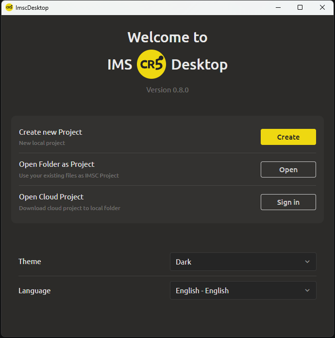
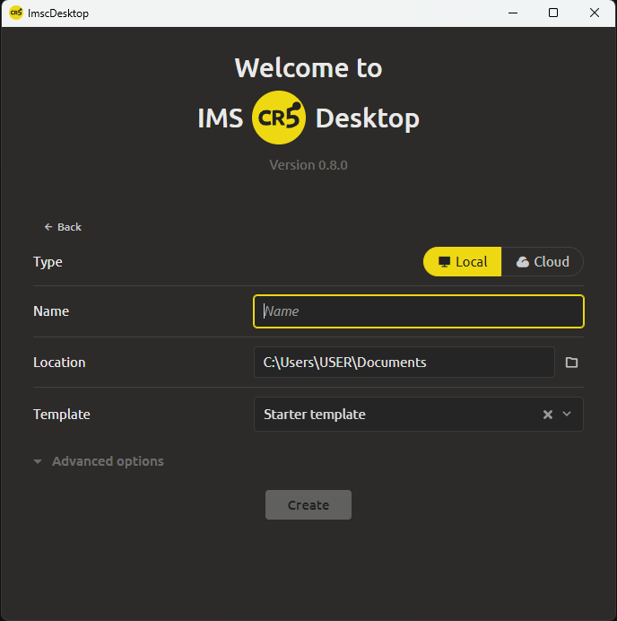

# Creating a New Project

To create a new project, follow these steps:

  
  

1. On the start screen, click the **Create** button

2. Select the **project type**:

   * **Local** – all project files will be stored only on your computer.

   * **Cloud** – the project will be automatically synchronized with cloud storage [see Cloud Sync section](../main-editor/cloud-sync.md).

3. Enter the **project name** (display name).

4. Specify the **location** – the directory for saving. By default, the «Documents» folder is suggested. You can choose any other folder on your drive.

5. Select a **starter template**. The system offers several preset templates (e.g., starter, RPG, platformer, etc.). You can click the preview button to see the template contents before selecting. If unsure, leave the default template. To create an empty project, click the cross in the template selection field

6. If needed, expand the **Advanced Settings** block. There you can specify a **Folder Name** different from the project name – this will be used for the folder on disk.

7. Click the **«Create»** button.

After the project is created, the **main workspace** will open with pre-generated elements from the selected template (e.g., welcome text explaining the core program functionality). You can start editing right away.
