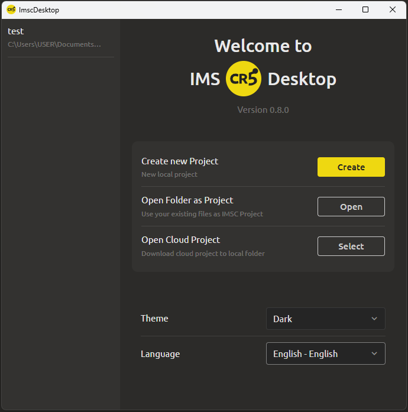

# Start Screen

  

When you launch the program, the **start screen** opens, which serves as the starting point for all operations. The following options are available:

* **Create a new project** – start from scratch or based on one of the built-in templates.

* **Open an existing folder as a project** – select any folder on your computer; the program will work with its contents as a project (all nested elements become available in the project tree).

* **Open a cloud project** – load a project previously saved to the cloud. After loading, it becomes available as a local project for further work.

* **Switch theme** – switch between **dark** and **light** interface themes

* **Select language** – you can change the interface language.

If you have worked in the program before, the left side of the start screen will display a **"Recently opened projects"** list. You can click on any of them to quickly resume working.
