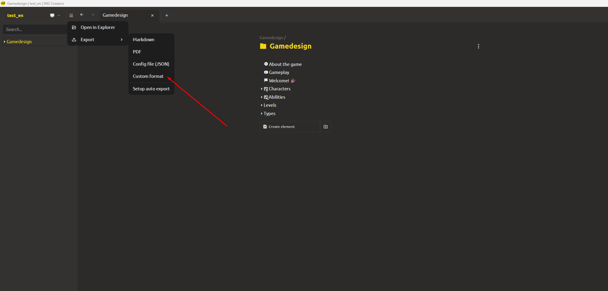
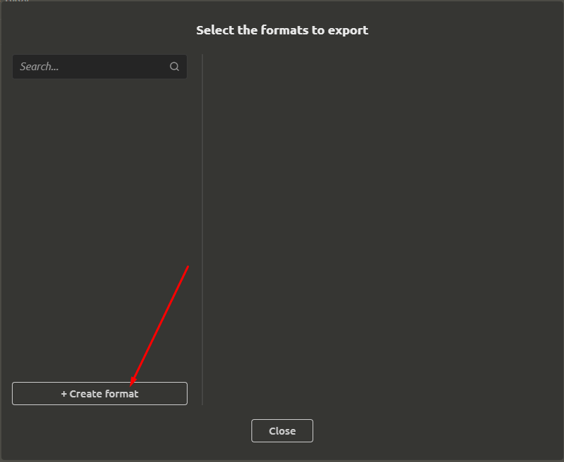
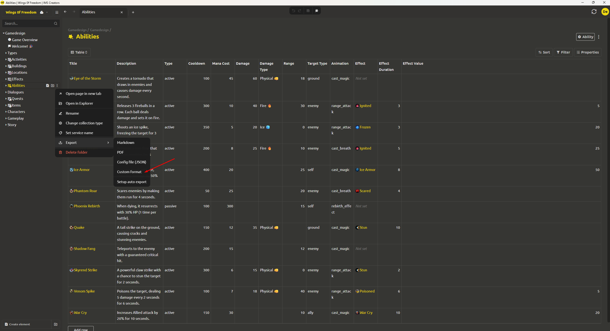
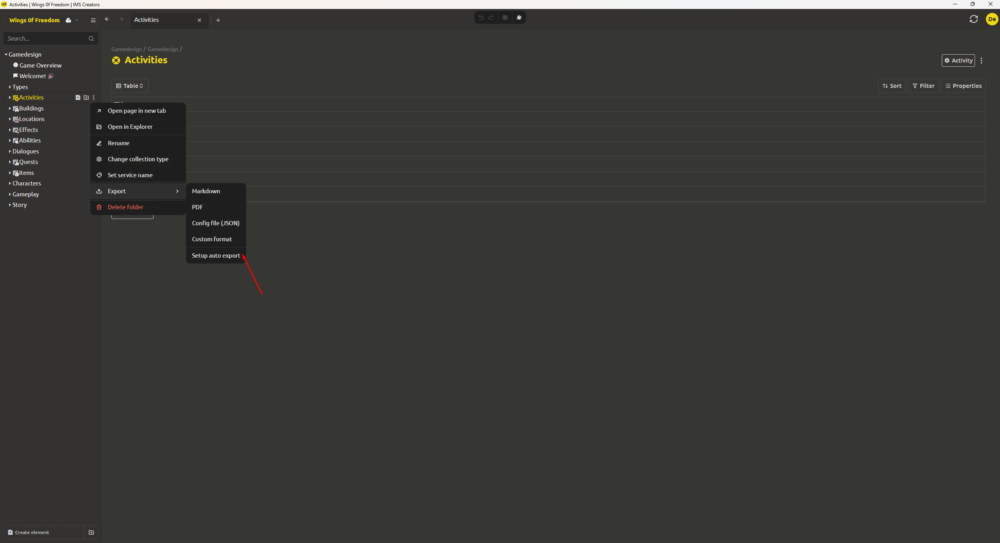

# Export to Custom Format

The system allows exporting elements in various formats for further use in game engines. Additionally, you can set up **automatic export** – changes in the project will be automatically exported to a specified folder.

<div align="center">
  
</div>

## Setting Up a Custom Export Format

If the standard formats are insufficient (e.g., you need a CSV file for Excel or a custom JSON with a limited set of fields), you can create a **custom export format**.

### Creating a New Format

<div align="center">
  
</div>

1. In the export menu, select **«My Format»**.

2. Click **«Create Format»**.

3. Enter the **format name** (e.g., "Character Export for CSV").

4. Specify which **element type** (or specific template) this format applies to. For example, you can select the base type "Game Object" or a specific template "Character". The format will only be available for elements of this type.

### Choosing the Output Format Type (CSV or JSON)

**For CSV:**

* Select the **fields** you want to export (from the structure of the selected element type). For example, for a character: `health`, `attack`, `name`. Fields can be both flat and nested (e.g., `stats.health`).

* Specify the **delimiter**: comma (`,`) or semicolon (`;`). Semicolon is recommended if values may contain commas.

* Check **«Add headers»** – the first row of the CSV will contain field names.

* **(Optional) Post-processing** – JS code to transform data before writing ([see Post-Processing Data with JavaScript](#post-processing-data-with-javascript)).

**For JSON:**

* Select one of the modes:

  * **«Full»** – export the entire internal element structure (including service fields like `id`, `createdAt`, etc.).

  * **«Values Only»** – export only the contents of `values` ([see Values Fields and Block Internal Names](asset-structure.md#values-fields-and-block-internal-names)). This is the cleanest option for the engine.

  * **«Selected Fields»** – export only specific fields (similar to CSV, but in JSON format).

* **Group into one file:**

  * If the checkbox is **enabled** – when exporting an entire folder or multiple elements, they will all be saved in **one** JSON file (array of objects).

  * If the checkbox is **disabled** – each element is saved in a **separate** JSON file (filename = internal name or `id`).

* **(Optional) Post-processing** – JS code to modify data before saving.

### Saving the Format

After configuration, click **«Save»**. The new format will appear in the export menu for the selected element type.

## Post-Processing Data with JavaScript

For flexible customization, you can add a **post-processor** – a small JS code snippet that runs before writing the file. The code should accept the element data object (in the format corresponding to the selected mode) and return the transformed object (or a primitive if it's a CSV string).

**Example for CSV (field transformation):**


```javascript
function process(data) {
  // data – element object in flat form (fields selected for CSV)
  return {
    name: data.title,
    hp: data.health * 2,      // double the health
    attack: data.attack
  };
}
```

**Example for JSON (removing service fields):**


```javascript
function process(data) {
  // data – full element object (if "Full" mode is selected)
  return {
    id: data.id,
    title: data.title,
    stats: data.values.stats
  };
}
```

**Limitations:**

* The code runs in a safe isolated environment (sandbox).

* Only standard JavaScript features (ES2020) are available.

* External API calls, file system access, and network requests are prohibited.

* The code must be synchronous and return a value.

## Export Using a Custom Format

<div align="center">
  
</div>

1. Select one or more elements (or an entire folder) in the project tree.

2. Right-click → **«Export»** → choose your saved format.

3. In the dialog, specify the **destination folder**.

4. Click **«Export»**.

The system will create file(s) in the specified format in the selected folder. When exporting a folder with grouping enabled, a single file containing an array of all elements will be created.

## Automatic Export

<div align="center">
  
</div>

To avoid manual export after every change, you can set up **automatic export**:

1. Click the **Configure auto-export** button in the menu

2. In the opened form, create one or more export configurations

3. Click the "Export" button and select a folder

4. Check the "Export automatically" checkbox

After this, **any change to an element** (or elements inside a folder) will be **automatically** written to the same files in the specified folder. Export happens in the background immediately after saving changes to the project.

**Example usage:**

* You set up a CSV format for exporting all characters.

* Enabled automatic synchronization to the folder `D:\GameProject\Characters`.

* Your game engine monitors changes in this folder (e.g., via `FileSystemWatcher` in C# or a re-reading timer in C++).

* Every time a character's health changes in the editor, the CSV file updates – and the game immediately uses the new value without restarting.

> [!TIP]
> Automatic synchronization is ideal for iterative development – you edit data in a convenient editor, and the engine instantly receives updates without additional steps.

## Recommendations for Engine Integration

* **For CSV** – convenient for exporting tabular data (item lists, character parameters). The engine can load CSV as simple tables. Use post-processing for type conversion.

* **For JSON** – recommended for complex hierarchical data. Use **«Values Only»** or **«Selected Fields»** mode to avoid cluttering the engine with service IDs and dates.

* **Automatic export** – point it to a folder that the engine monitors. This allows reloading data on the fly.

* **Post-processing** – helps adapt data to the engine's specific API: rename fields, merge values, calculate derived parameters, filter unnecessary elements.

* **Performance** – avoid exporting large collections into a single file if the engine re-reads it entirely. In such cases, use the "separate files" mode or split data across multiple formats.
