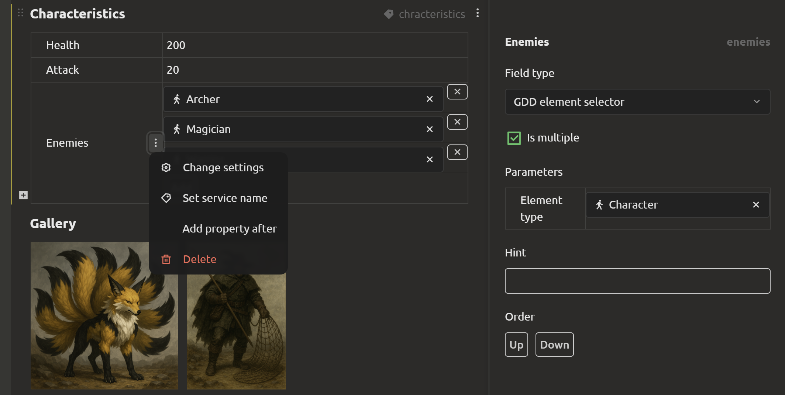

# Document Block Types

All documents in the system are built from **blocks**. A single document can contain blocks of different types, arranged vertically in any order. Each block can have a **title** (display name) and an **internal name** (used when exporting to the engine, [see Engine Integration section](../integration/index.md)).

Below is a description of all available block types.

## Text Block

A plain text field. Supports:

- text input
- image insertion
- basic formatting: **bold**, *italic*, underline, strikethrough, headings, lists, links, etc.

## Table

A table with multiple columns and rows. Used for entering structured data when you need to store many records (e.g., enemy stat scaling by level).

One of the columns will be the **key** column, such as level number

By default, table cell values are text, but you can configure each column by specifying:
  - **Data type** – the kind of values that will be entered in cells (e.g., numbers, enumeration, structure, element reference)
  - **Multiple values** – allows entering multiple values in a single cell
  - **Column internal name** – used during export

## Property Sheet

Differs from the values table in that it defines **properties of the current element** (property → value pairs). It does not have multiple records across columns – each property has exactly one value. Useful for describing character, object, or mechanic parameters.

**Features:**
- Two columns: "Property" and "Value".
- Value types are similar to the values table.

### Configuring Properties

Properties can be **Configured** by clicking the dots on the right. A tab will open on the right with parameter selection:

- **Field type.** The field can be of the following types: `String`, `Number`, `Text`, `Boolean`, `Date picker`, `File picker`, `Structure`, `Enumeration`, `Enumeration (radio buttons)`.
- **Multiple.** If a property can have multiple values, check the box.
- **Order.** Contains 2 buttons: `Up` and `Down`, used to change the order of properties.

## Gallery

A block for working with images and external content.

**What can be added:**

- **Image from computer** – upload a file (PNG, JPG, GIF, etc.).
- **Video link** – insert a link, e.g., to YouTube
- **Image link** – specify a URL of an image.
- **Image from clipboard** – paste a copied image.

The gallery can contain multiple elements displayed as tiles

## Embedded Document

Embedding an external website page: Google Docs, Figma, Miro, and other services that support embedding

## Checklist

A task list with the ability to mark completion. Useful for tracking progress, requirement lists, production steps, etc.

## Diagram

A visual editor for creating diagrams and graphs.

**Features:**

- Creating **blocks** (nodes) of different shapes and colors.
- Connecting blocks with **edges** (arrows, lines).
- Entering **values** in blocks (text, numbers).
- Moving nodes and connections.

Used for designing architecture, logic diagrams, mind maps, etc.

> **Note:** The example in the image shows how project elements can be referenced directly within blocks.

## Script

A block for creating **dialogs**, **scenarios**, or **visual scripts** (resembling Unreal Engine blueprints). Works based on a node graph [see Script (Dialog) Storage section](../integration/block-script-structure.md#script-dialog-storage).

**Available nodes:**

| Node | Purpose |
|------|---------|
| **Start** | Entry point into the script |
| **Speech** | Speech text and player choice menu |
| **Branch** | Select one or another dialog branch depending on a condition |
| **Trigger** | Call external engine functions (health change, item acquisition, etc.) |
| **Get Variable** | Read a variable value |
| **Set Variable** | Set a variable value |
| **Arithmetic and Logical Operations** | Addition, multiplication, comparison, AND/OR, etc. |
| **End** | Script termination |

Scripts can use local variables and interact with game logic through triggers.

For executing scripts in web engines (Phaser, Pixi.js, etc.), a **JavaScript library** [`imsc-script-js`](https://github.com/ImStocker/imsc-script-js/) is available.

## Level Editor

A block for visual game level design. It is a **canvas** on which various shapes and objects are placed [see Level Storage section](../integration/block-level-structure.md#level-storage).

**Features:**

- Load a **background image** of the map (e.g., a location layout).
- Place **polygons**, **rectangles**, **ellipses** to mark areas (collisions, zones of interest, spawns).
- Add **pointers** to game objects (characters, items, events) – linked to project elements.
- Manage layer order (Z-index).
- Lock objects to prevent accidental movement.

The level editor allows visually setting up a scene, and the engine can interpret this data for placing objects in the game.

## Grid Text

A block for placing text in a **grid structure** with configurable rows and columns.

**Features:**

- Create a **grid** of cells for structured text placement (default 1 row × 2 columns).
- Add **cells** to expand the table.
- Fill each cell with **independent text content** (with or without formatting).
- Use for **comparing** data (e.g., "before / after", "option A / option B").
- Place **paired descriptions** (problem / solution, question / answer, property / value).

> [!TIP]
> **Note:** Blocks can be freely combined in a single document. For example, a "Character Description" document can contain: a properties table (stats), a gallery (portraits), a text block (biography), a checklist (development plan).
