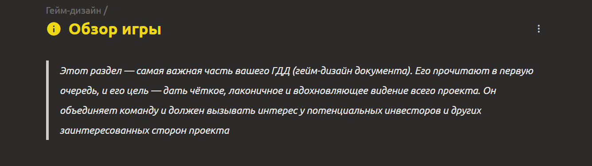
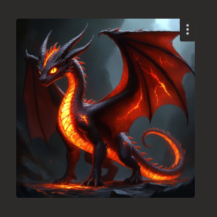
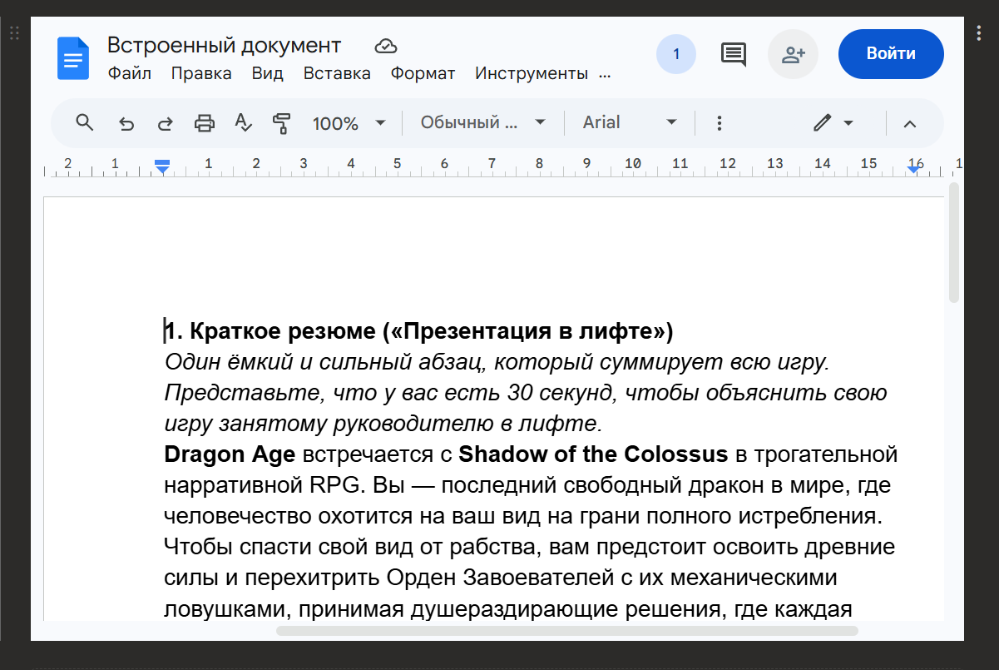
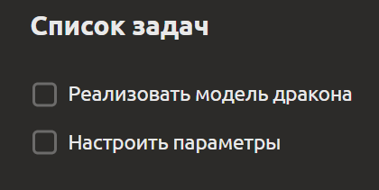
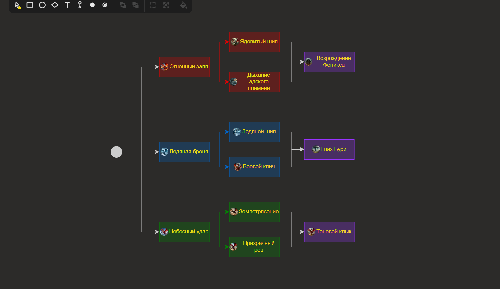
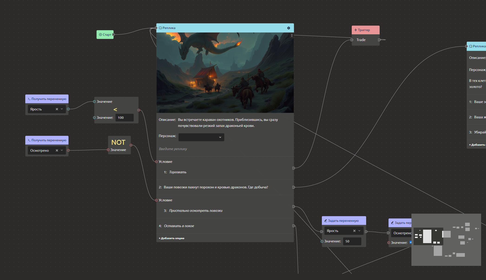
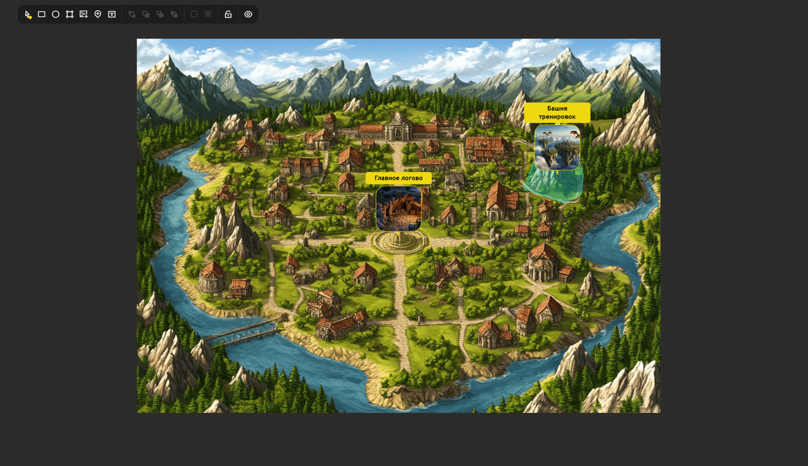
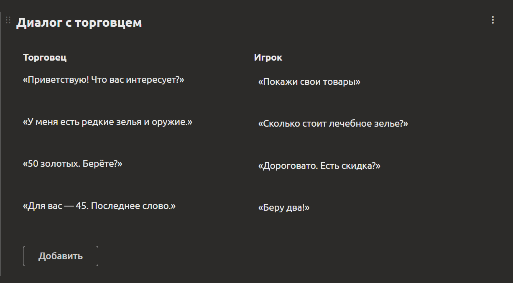

# Типы блоков документа

Все документы в системе строятся из **блоков**. Один документ может содержать блоки разных типов, расположенные вертикально в любом порядке. Каждый блок можно снабдить **заголовком** (отображаемое имя) и **служебным именем** (используется при выгрузке в движок, [см. раздел Интеграция с движком](../integration/engine-integration.md)).

Ниже приведено описание всех доступных типов блоков.

## Текстовый блок

Обычное текстовое поле. Поддерживает:

- ввод текста
- вставку изображений
- базовое форматирование: **жирный**, *курсив*, подчёркивание, зачёркивание, заголовки, списки, ссылки и т.д.

## Таблица значений

Таблица с несколькими колонками и строками. Используется для ввода структурированных данных, когда нужно хранить множество записей (например, изменение характеристик врага в зависимости от уровня).

Одна из колонок будет **ключевой**, например, номер уровня

По умолчанию в значения ячеек таблицы текстовы, но вы можете настроить каждую колонку, указав ей:
  - **Тип данных** - вид значений, который будут вписываться в ячейку (например, числа, перечисление, структура, ссылка на элемент)
  - **Множественное значение** – можно вписывать несколько значений в одну ячейку.
  - **Служебное имя** колонки – используется при выгрузке.

## Таблица свойств

Отличается от таблицы значений тем, что задаёт **свойства текущего элемента** (пары «свойство → значение»). В ней нет множества записей по колонкам – каждое свойство имеет ровно одно значение. Удобно для описания параметров персонажа, объекта или механики.

**Особенности:**
- Два столбца: «Свойство» и «Значение».
- Типы значений аналогичны таблице значений.

## Галерея

Блок для работы с изображениями и внешним контентом.

**Что можно добавить:**

- **Изображение с компьютера** – загрузить файл (PNG, JPG, GIF и др.).
- **Ссылку на видео** – вставить ссылку, например, на YouTube
- **Ссылку на изображение** – указать URL картинки.
- **Изображение из буфера обмена** – вставить скопированное изображение.

Галерея может содержать несколько элементов, отображаемых в виде плиток

## Прикреплённый документ

Встраивание страницы внешнего сайта: Google Docs, Figma, Miro и другие сервисы, поддерживающие встраивание

## Чек-лист

Список задач с возможностью отмечать выполнение. Удобен для отслеживания прогресса, списков требований, шагов производства и т.п.

## Блок-схема

Визуальный редактор для создания схем и графов.

**Функции:**

- Создание **блоков** (узлов) разной формы и цвета.
- Связывание блоков **рёбрами** (стрелками, линиями).
- Ввод **значений** в блоки (текст, числа).
- Перемещение узлов и связей.

Используется для проектирования архитектуры, логических схем, карт связей и т.д.

## Сценарий

Блок для создания **диалогов**, **сценариев** или **визуальных скриптов** (напоминает блюпринты из Unreal Engine). Работает на основе графа узлов [см. раздел Хранение сценариев (диалогов)](../integration/engine-integration.md#хранение-сценариев-диалогов).

**Доступные узлы:**

| Узел | Назначение |
|------|-------------|
| **Старт** | Точка входа в сценарий |
| **Реплика** | Текст реплики и меню выбора игрока |
| **Ветвление** | Выбор той или иной ветки диалога в зависимости от условия |
| **Триггеры** | Вызов внешних функций движка (изменение здоровья, получение предмета и т.п.) |
| **Переменные** | Чтение и установка переменных |
| **Арифметические и логические операции** | Сложение, умножение, сравнение, И/ИЛИ и т.д. |
| **Конец** | Завершение сценария |

Сценарии могут использовать локальные переменные, а также взаимодействовать с игровой логикой через триггеры.

Для исполнения сценариев в веб-движках (Phaser, Pixi.js и др.) доступна **JavaScript-библиотека** [`imsc-script-js`](https://github.com/ImStocker/imsc-script-js/).

## Редактор уровня

Блок для визуального проектирования игровых уровней. Представляет собой **холст**, на котором размещаются различные фигуры и объекты [см. раздел Хранение уровня (Level Editor)](../integration/engine-integration.md#хранение-уровня-level-editor).

**Возможности:**

- Загрузить **фоновую картинку** карты (например, схему локации).
- Разместить **полигоны**, **прямоугольники**, **эллипсы** для обозначения областей (коллизий, зон интереса, спавнов).
- Добавить **указатели** на игровые объекты (персонажи, предметы, события) – привязка к элементам проекта.
- Управлять порядком слоёв (Z-индекс).
- Блокировать объекты от случайного перемещения.

Редактор уровня позволяет визуально настроить сцену, а движок может интерпретировать эти данные для расстановки объектов в игре.

## Текст сеткой

Блок для размещения текста в **сеточной структуре** с возможностью настройки количества строк и столбцов.

**Возможности:**

- Создать **сетку** из ячеек для структурированного размещения текста (по умолчанию 1 строка × 2 столбца).
- Добавлять **ячейки** для расширения таблицы.
- Заполнять каждую ячейку **независимым текстовым содержимым** (с форматированием или без).
- Использовать для **сравнения** данных (например, «было / стало», «вариант A / вариант B»).
- Разместить **парные описания** (проблема / решение, вопрос / ответ, свойство / значение).

::: tip **Примечание:** Блоки можно свободно комбинировать в одном документе. Например, документ «Описание персонажа» может содержать: таблицу свойств (характеристики), галерею (портреты), текстовый блок (биография), чек-лист (план по разработке).
:::