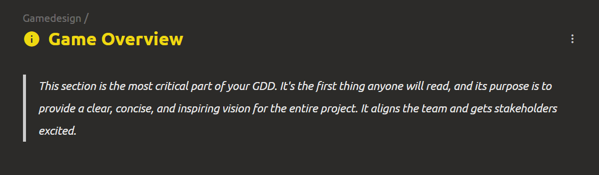
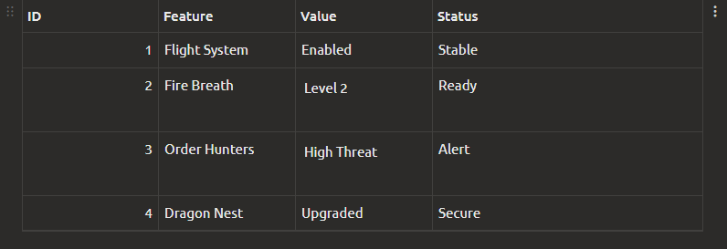
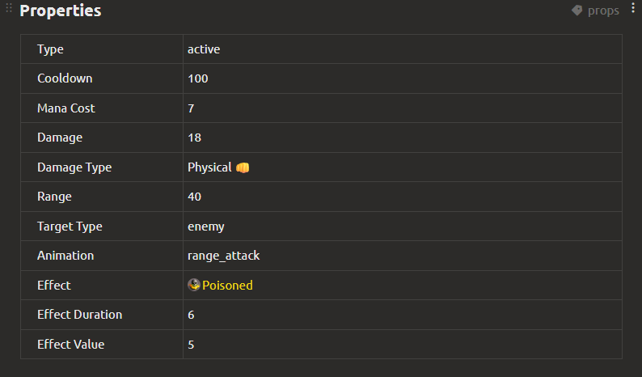
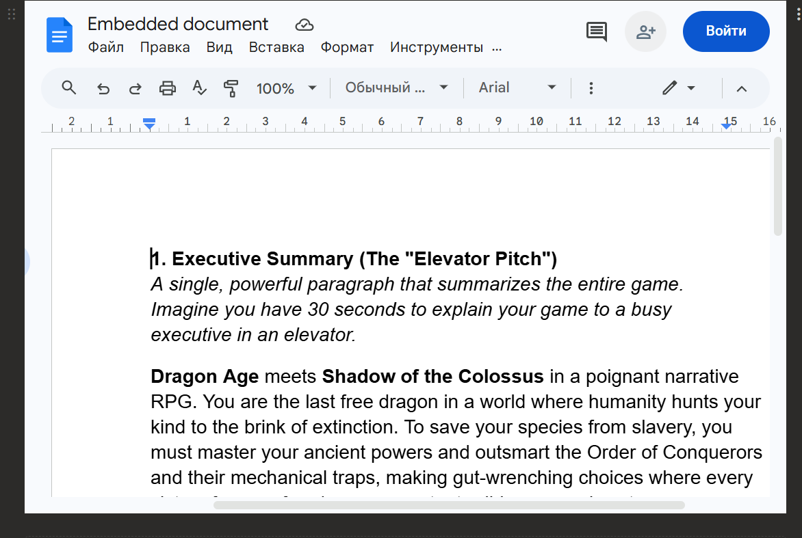
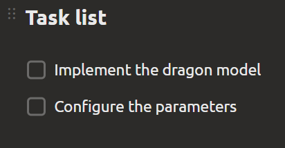
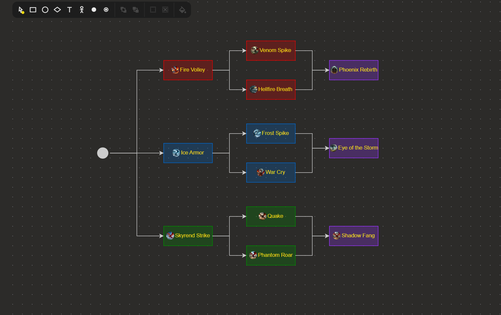
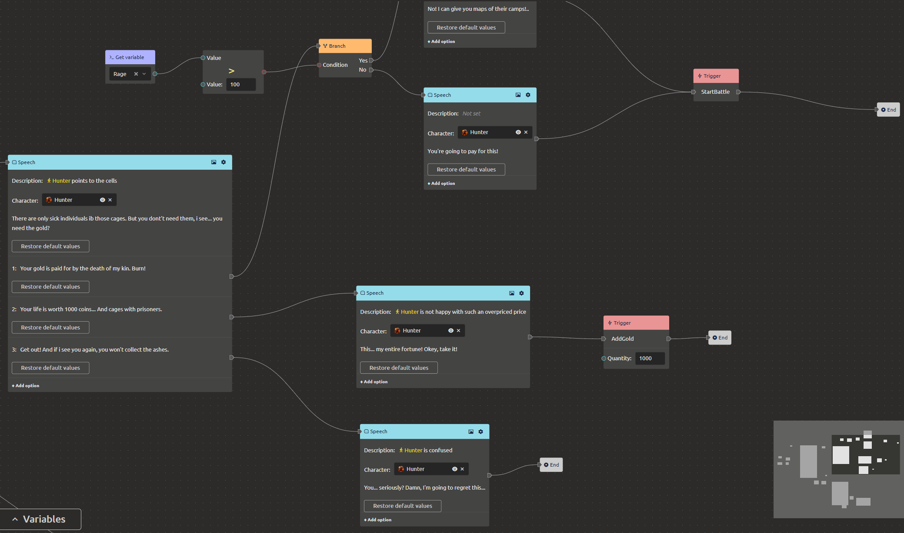
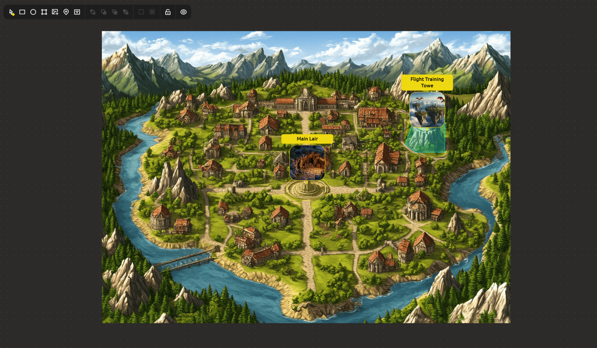
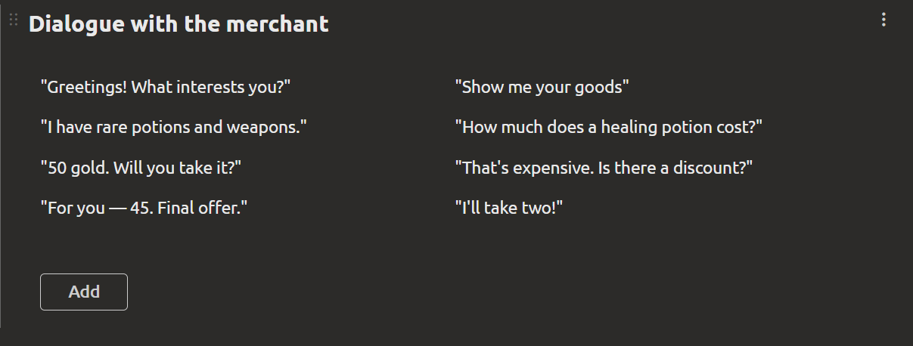

# Document Block Types

All documents in the system are built from **blocks**. A single document can contain blocks of different types, arranged vertically in any order. Each block can be given a **title** (display name) and an **internal name** (used when exporting to the engine, [see Engine Integration section](../integration/index_en.md)).

Below is a description of all available block types.

## Text Block

A regular text field. Supports:

- text input
- image insertion
- basic formatting: **bold**, *italic*, underline, strikethrough, headings, lists, links, etc.

## Table

A table with multiple columns and rows. Used for entering structured data when you need to store multiple records (for example, enemy characteristic changes depending on level).

One of the columns will be a **key** column, for example, the level number.

By default, table cell values are text, but you can configure each column by specifying:
  - **Data type** - the kind of values that will be entered into the cell (for example, numbers, enumeration, structure, element reference)
  - **Multiple values** – you can enter multiple values in a single cell.
  - **Internal name** of the column – used during export.

## Property sheet

Differs from the values table in that it defines **properties of the current element** (pairs of "property → value"). It does not have multiple records across columns – each property has exactly one value. Convenient for describing character, object, or mechanic parameters.

**Features:**
- Two columns: "Property" and "Value".
- Value types are similar to the values table.

## Gallery

A block for working with images and external content.

**What you can add:**

- **Image from computer** – upload a file (PNG, JPG, GIF, etc.).
- **Video link** – paste a link, for example, to YouTube.
- **Image link** – specify an image URL.
- **Image from clipboard** – paste a copied image.

The gallery can contain multiple items displayed as tiles.

## Embedded Document

Embedding a page from an external site: Google Docs, Figma, Miro, and other services that support embedding.

## Checklist

A task list with the ability to mark completion. Useful for tracking progress, requirement lists, production steps, etc.

## Diagram

A visual editor for creating diagrams and graphs.

**Functions:**

- Creating **blocks** (nodes) of different shapes and colors.
- Linking blocks with **edges** (arrows, lines).
- Entering **values** into blocks (text, numbers).
- Moving nodes and connections.

Used for designing architecture, logic diagrams, mind maps, etc.

## Script

A block for creating **dialogs**, **scripts**, or **visual scripts** (similar to blueprints in Unreal Engine). Works based on a node graph [see Script (Dialog) Storage section](../integration/block-script-structure_en.md#script-dialog-storage).

**Available nodes:**

| Node | Purpose |
|------|-------------|
| **Start** | Entry point into the script |
| **Speech** | Character replica text and player choice menu |
| **Branch** | Choosing one dialog branch or another depending on the condition |
| **Triggers** | Calling external engine functions (health change, item acquisition, etc.) |
| **Variables** | Reading and setting variables |
| **Arithmetic and logical operations** | Addition, multiplication, comparison, AND/OR, etc. |
| **End** | Script termination |

Scripts can use local variables, as well as interact with game logic through triggers.

For executing scripts in web engines (Phaser, Pixi.js, etc.), a **JavaScript library** [`imsc-script-js`](https://github.com/ImStocker/imsc-script-js/) is available.

## Level Editor

A block for visual design of game levels. Represents a **canvas** on which various shapes and objects are placed [see Level Storage section](../integration/block-level-structure_en.md#level-storage).

**Capabilities:**

- Load a **background image** of the map (for example, a location schematic).
- Place **polygons**, **rectangles**, **ellipses** to mark areas (collisions, zones of interest, spawns).
- Add **pointers** to game objects (characters, items, events) – binding to project elements.
- Manage layer order (Z-index).
- Lock objects from accidental movement.

The level editor allows you to visually configure the scene, and the engine can interpret this data for placing objects in the game.

## Grid Text

A block for placing text in a **grid structure** with the ability to configure the number of rows and columns.

**Capabilities:**

- Create a **grid** of cells for structured text placement (default is 1 row × 2 columns).
- Add **cells** to expand the table.
- Fill each cell with **independent text content** (formatted or plain).
- Use for **comparing** data (for example, "before / after", "option A / option B").
- Place **paired descriptions** (problem / solution, question / answer, property / value).

::: tip **Note:** Blocks can be freely combined in a single document. For example, a "Character Description" document can contain: a properties table (characteristics), a gallery (portraits), a text block (biography), a checklist (development plan).
:::