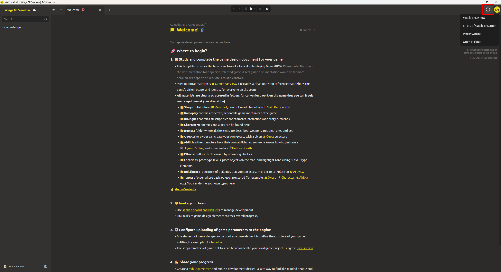

# Cloud Sync

The system supports working with **cloud projects**. This allows you to store a copy of the project on a remote server, access it from different devices, and collaborate with colleagues.

## Connecting a Cloud Project

You can work with a cloud project in two ways:

1. **Create a new cloud project** – when creating a project [see Creating a New Project section](../getting-started/create-project.md) select the "Cloud" type. The project will be automatically saved locally and on the server.
2. **Open an existing cloud project** – on the start screen, click "Open cloud project" and select the desired project from the list. After downloading, it becomes available as a local project for further work.

## Sync Button

  

In the editor interface, in the top-right corner, there is a **"Sync"** button (shaped like arrows).

- **When clicked**, the local project version is compared with the cloud version.
- Changes made locally are uploaded to the cloud.
- If the cloud version is newer (you worked from another device), changes are pulled locally.

## Converting a Local Project to Cloud

If you already have a local project, you can "attach" it to the cloud:

1. Open the local project.
2. Click the sync button.
3. The system will offer to link the project to the cloud – confirm the action.
4. After this, the project will be uploaded to the cloud, and subsequent synchronization will work as for a regular cloud project.
