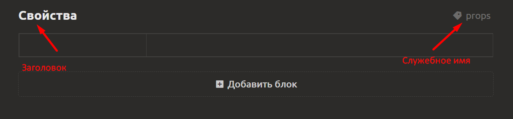

# Интерфейс редактора

## Рабочая область после создания проекта

После создания проекта открывается **главная рабочая область** – основное пространство для работы с элементами и их содержимым.

- **По умолчанию** в рабочей области уже присутствуют элементы, созданные из выбранного стартового шаблона. Например, вы увидите приветственный элемент, в котором кратко рассказывается об основном функционале программы.
- **Левая панель (дерево проекта)** отображает иерархию всех элементов проекта: документы, папки, коллекции, игровые объекты и т.д.
- В левой панели (**снизу**) расположены кнопки для создания новых элементов и папок.  
  - Чтобы создать новый элемент, нажмите соответствующую кнопку и выберите один из типов [см. раздел Типы создаваемых элементов](element-types.md).  
  - Чтобы создать папку, нажмите кнопку справа от "Создать элемент", выберите тип «Папка». Папки помогают группировать любые элементы без ограничений по типу. Подробнее [см. раздел Организация содержимого](organize-content.md).
- **Центральная область** предназначена для редактирования выбранного элемента. Чтобы выбрать элемент, просто нажмите на него в дереве слева.
- **Правая панель** (опционально) может содержать дополнительные настройки, инспектор свойств или информацию о выбранном элементе.

## Редактор документа (элемента)

При открытии любого элемента (документа, игрового объекта, сценария и т.д.) появляется **редактор**, интерфейс которого зависит от типа элемента, но общие принципы одинаковы.

Документ состоит из **набора блоков**, которые располагаются вертикально. В одном документе могут сочетаться блоки разных типов:
- текстовые
- таблицы значений
- таблицы свойств
- галерея
- прикреплённый документ
- чек-лист
- блок-схема
- скрипт / сценарий
- редактор уровня
- текст сеткой

**Управление блоками:**
- Добавление нового блока – через кнопку «+ Добавить блок» снизу документа.
- Вы можете перетаскивать блоки для изменения их порядка
- У каждого блока есть **заголовок** (отображаемое имя) и **служебное имя** используется при выгрузке в движок, [см. раздел Интеграция с движком](../integration/engine-integration.md)

- Блоки можно дублировать, удалять, временно скрывать.

> Подробное описание каждого типа блока приведено в [разделe Типы блоков документа](block-types.md).
