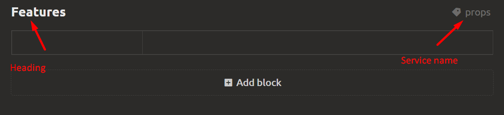
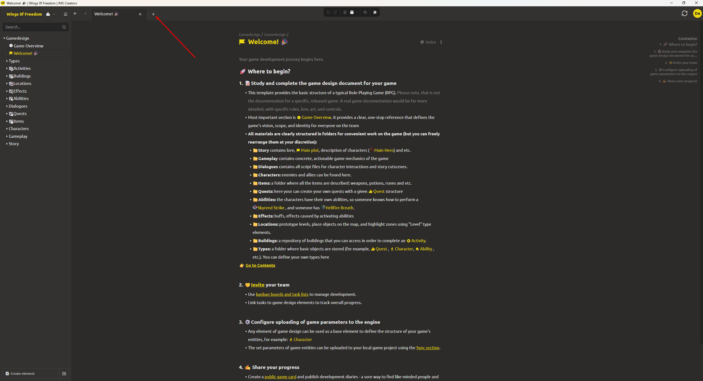
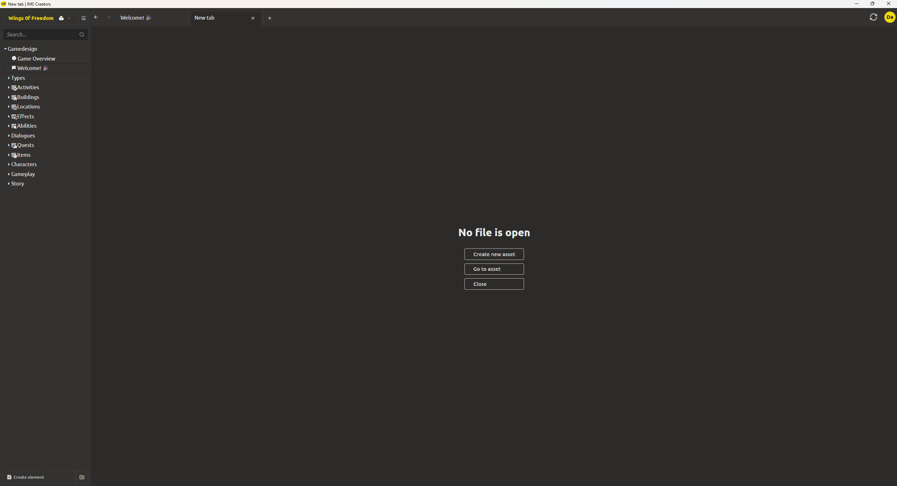

# Editor Interface

## Workspace After Project Creation

After creating a project, the **main workspace** opens – the primary space for working with elements and their content.

- **By default**, the workspace already contains elements created from the selected starter template. For example, you will see a welcome element that briefly describes the core program functionality.
- **Left panel (project tree)** displays the hierarchy of all project elements: documents, folders, collections, game objects, etc.
- At the **bottom** of the left panel are buttons for creating new elements and folders.  
  - To create a new element, click the corresponding button and select one of the types [see Element Types section](element-types.md).  
  - To create a folder, click the button to the right of "Create element", select the "Folder" type. Folders help group any elements without type restrictions. For more details [see Content Organization section](organize-content.md).
- **Central area** is for editing the selected element. To select an element, simply click on it in the tree on the left.
- **Right panel** (optional) may contain additional settings, a property inspector, or information about the selected element.

## Document (Element) Editor

When opening any element (document, game object, script, etc.), an **editor** appears, whose interface depends on the element type, but the general principles are the same.

The document consists of a **set of blocks** arranged vertically. A single document can combine blocks of different types:
- [text](block-types.md#text-block) 
- [values tables](block-types.md#values-table)
- [properties tables](block-types.md#properties-table)
- [gallery](block-types.md#gallery)
- [embedded document](block-types.md#embedded-document)
- [checklist](block-types.md#checklist)
- [diagram](block-types.md#diagram)
- [script / scenario](block-types.md#script)
- [level editor](block-types.md#level-editor)
- [grid text](block-types.md#grid-text)

**Block management:**
- Adding a new block – via the "+ Add block" button at the bottom of the document.
- You can drag blocks to change their order
- Each block has a **title** (display name) and an **internal name** used when exporting to the engine, [see Engine Integration section](../integration/index.md)
- Blocks can be duplicated, deleted, or temporarily hidden.

> Detailed description of each block type is provided in the [Document Block Types section](block-types.md).

## Tabs

  
  

The editor supports working with **multiple tabs** – you can have several elements open simultaneously and switch between them. Each tab corresponds to one open document or object.

- To create a new tab, click the **«+»** button in the tab panel (usually located at the top of the central area).
- Within each tab, **actions** are available: save changes, rename tab, close, etc. Actions are invoked via the context menu or special buttons next to the name.

This approach allows parallel work on different parts of the project without losing context.
