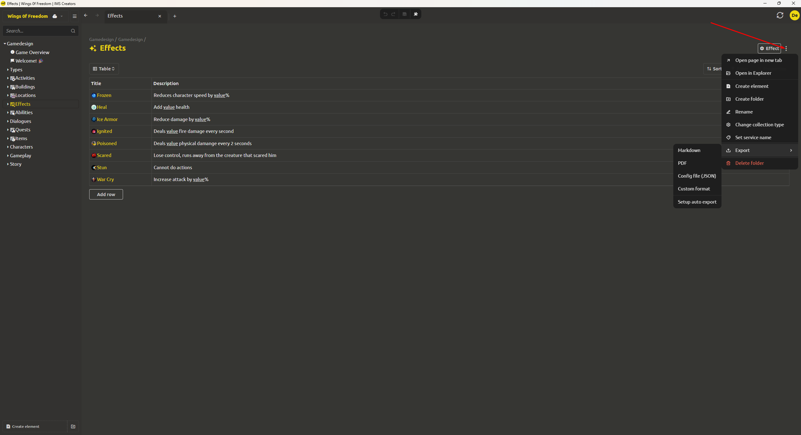

# **Export**

Right-click on any element (or click the three dots next to it) and select **«Export»**. The following options are available:

* **Markdown (.md)** – export to a text format with Markdown markup. Convenient for publishing documentation or inserting into a wiki.

* **PDF (.pdf)** – export to a PDF document (preserves formatting, suitable for printing and distribution).

* **JSON (.json)** – export to the system's native format (a complete copy of the internal data, matching the on-disk storage format).

> **Important:** The JSON format completely matches the internal representation of the element. It can be used for backup, re-importing into the system, or for integration with engines that support reading JSON. If standard JSON is not enough, create an **export to your own format** — [see "Export to Custom Format" section](../integration/export-format.md).
