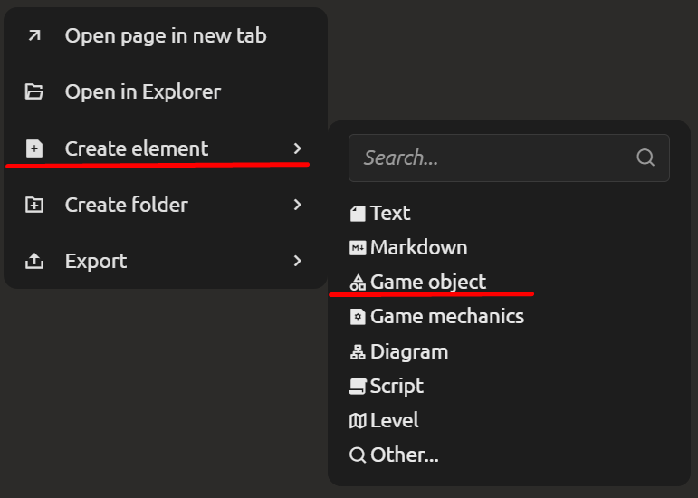

# Game Objects and Templates

The system has a special type of elements — **game objects**. These are pre-configured entities that include an illustrative image, a description, and a set of properties typical for game units (characters, items, enemies, etc.).

However, the "template → instance" mechanism works **for any element**, regardless of its type (text document, table, checklist, diagram, script, etc.). Game objects are just a specific, though illustrative, example.

## Base Template Object

A base object (template) defines the **structure** and **default values** of properties for all objects of a certain type.

**How to create a base game object template:**
1. In the project tree, select the command to create a new element.
2. As the type, specify "Game Object".

3. Set the template name, e.g., "Base Character".
4. Configure the template structure: add the necessary blocks (a properties table with health, strength, mana parameters; a gallery with a portrait; a text description, etc.).
5. Fill in the default property values (e.g., `health = 100`, `strength = 10`).

After this, the template can be used to create specific objects (instances).

## Creating an Object Instance

An instance (a specific character or item) is created **based on an existing element**. It automatically inherits the entire structure and default values from the parent element, which automatically starts acting as a template.

**How to create an instance:**
1. Right-click on any element (template) in the project tree.
2. Select the **"Create instance"** command.
3. Specify the instance name (e.g., "Orc Warrior").
4. If needed, change the **initial property values** to differ from the template values (e.g., increase health or replace the image).

All instances are displayed in the project tree and can be edited like regular elements. The original element **does not require any special switching to "template" mode**. It remains a regular element, but now at least one instance has been created from it.

## Any Element as a Template (Universal Mechanism)

The system allows creating an instance **from any existing element**, regardless of its type. You don't need to pre-"designate" an element as a template – just invoke the "Create instance" command.

**Examples of using the universal mechanism:**

- **Standard document template** – create a "Spec Structure" document with standard blocks. Create an instance "Spec for Module A" and change the text. Later update the original template — changes will propagate to all instances where no manual edits were made.
- **Checklist template** – make a standard "Before Release" list. Create instances for each version from it.
- **Dialog script template** – write the logic of a standard dialog, create instances with different lines from it.
- **Location template** – set a basic level layout and create level instances based on it

> [!TIP]
> When creating an instance, the original element remains a regular element, but now functions as a template. You can continue editing it, and all changes (except overridden fields) will be automatically passed to instances. If you delete the template, instances are not deleted but lose their connection to it (becoming independent).

 Instances can be created not only from direct templates but also from other instances, forming an inheritance hierarchy. This allows building deep chains of overrides.
