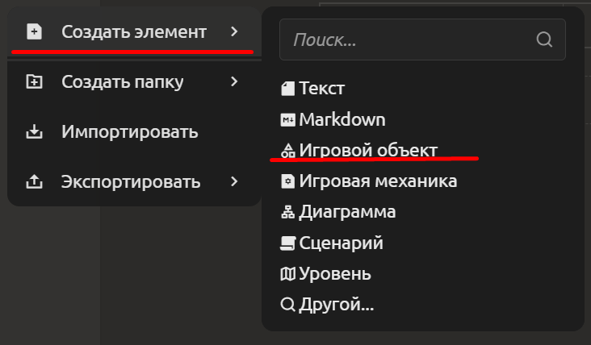

# Игровые объекты и шаблоны

В системе существует специальный тип элементов — **игровые объекты**. Это готовые, предварительно сконфигурированные сущности, которые включают в себя иллюстрирующую картинку, описание и набор свойств, характерных для игровых единиц (персонажи, предметы, враги и т.п.). 

Однако механика «шаблон → экземпляр» работает **для любого элемента**, независимо от его типа (текстовый документ, таблица, чек-лист, диаграмма, сценарий и т.д.). Игровые объекты — лишь частный, но наглядный пример.ы

## Базовый объект-шаблон

Базовый объект (шаблон) определяет **структуру** и **стандартные значения** свойств для всех объектов определённого типа.

**Как создать базовый шаблон игрового объекта:**
1. В дереве проекта выберите команду создания нового элемента.
2. В качестве типа укажите «Игровой объект».

3. Задайте имя шаблона, например «Базовый персонаж».
4. Настройте структуру шаблона: добавьте нужные блоки (таблицу свойств с параметрами здоровья, силы, маны; галерею с портретом; текстовое описание и т.д.).
5. Заполните стандартные значения свойств (например, `здоровье = 100`, `сила = 10`).

После этого шаблон можно использовать для создания конкретных объектов (экземпляров).

## Создание экземпляра объекта

Экземпляр (конкретный персонаж или предмет) создаётся **на основе существующего элемента**. Он автоматически наследует всю структуру и стандартные значения от родительского элемента, который автоматически начинает играть роль шаблона.

**Как создать экземпляр:**
1. Нажмите правой кнопкой мыши на любом элементе (шаблоне) в дереве проекта.
2. Выберите команду **«Создать экземпляр»**.
3. Укажите имя экземпляра (например, «Орк-воин»).
4. При необходимости измените **начальные значения свойств**, чтобы они отличались от шаблонных (например, увеличить здоровье или заменить картинку).

Все экземпляры отображаются в дереве проекта и могут редактироваться как обычные элементы. Исходный элемент при этом **не требует никакого специального переключения в режим «шаблон»**. Он остаётся обычным элементом, но теперь от него создан хотя бы один экземпляр.

## Любой элемент как шаблон (универсальный механизм)

Система позволяет создать экземпляр **от любого существующего элемента**, независимо от его типа. Вам не нужно предварительно «назначать» элемент шаблоном – достаточно вызвать команду «Создать экземпляр».

**Примеры использования универсального механизма:**

- **Шаблон типового документа** – создайте документ «Структура ТЗ» с типовыми блоками. Создайте от него экземпляр «ТЗ для модуля А» и измените текст. Позже обновите исходный шаблон — изменения подтянутся во все экземпляры, где не было ручных правок.
- **Шаблон чек-листа** – сделайте стандартный список «Перед релизом». От него создавайте экземпляры для каждой версии.
- **Шаблон сценария диалога** – напишите логику типового диалога, от него создавайте экземпляры с разными репликами.
- **Шаблон локации** – задайте базовую форму уровня и создавайте на его основе экземпляры уровней

::: tip 
При создании экземпляра исходный элемент остаётся обычным элементом, но теперь он выполняет функцию шаблона. Вы можете продолжать его редактировать, и все изменения (кроме переопределённых полей) будут автоматически передаваться экземплярам. Если вы удалите шаблон, экземпляры не удаляются, но теряют связь с ним (становятся самостоятельными).
:::

 Экземпляры могут создаваться не только от прямых шаблонов, но и от других экземпляров, образуя иерархию наследования. Это позволяет строить глубокие цепочки переопределений.