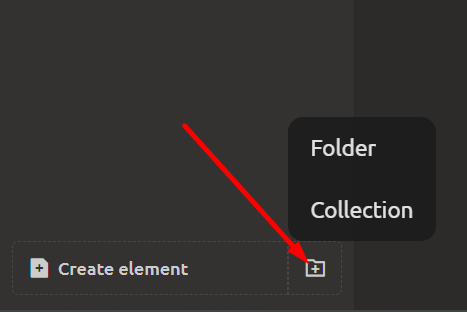
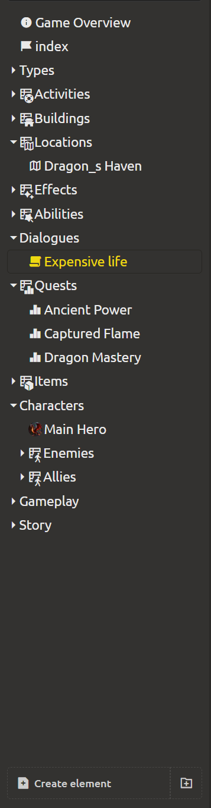
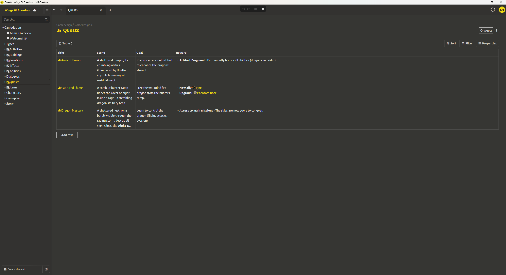

# Content Organization

As a project grows, the number of elements increases. For convenient navigation, structuring, and bulk work with data, the system provides two main tools: **folders** and **collections**.

<div align="center">
  
</div>

## Folders

Folders are designed for **grouping any elements** (documents, game objects, blocks, scripts, etc.) **without type restrictions**. A single folder can contain elements of different types.

**Creating a folder:**
- In the left panel (project tree), click the button to the right of "Create element" and select the **"Folder"** type.
- Set the folder name (e.g., "Characters", "Locations", "Dialogs", "Artifacts").

**Using folders:**
- Drag existing elements into and out of folders.
- You can create **nested folders** inside folders (any depth of nesting).
- Folders help organize a project by meaningful sections without mixing heterogeneous elements.

<div align="center">
  
</div>

## Collections

**Collection** is a special type of folder that is **bound to a specific element type** (or to a specific reference element). All elements created inside a collection are automatically created as **instances** of that reference [see Any Element as a Template (Universal Mechanism) section](game-objects-and-templates.md#any-element-as-a-template-universal-mechanism).

**How to create a collection:**
1. In the project tree, click the button to the right of "Create element".
2. Select the **"Collection"** type.
3. Specify the **source element** (reference) from which the structure and content will be taken. This can be:
   - a game object (e.g., "Base Character");
   - a text document (e.g., "Quest Template");
   - a checklist, diagram, script, structure, enumeration — any element.
4. Set the collection name (e.g., "Quests").

<div align="center">
  
</div>

**Working with collections:**

- **Bulk editing** — you can open a collection as a **table**, where rows are collection elements and columns are their properties. This allows quickly changing values across many elements simultaneously (e.g., increasing the health level for all characters in a collection).
- **Editing individual elements** — each collection element can be opened as a regular element and modified individually (including adding unique blocks without affecting others).
- **Automatic typing** — when creating a new element inside a collection, you don't need to select a type each time; it is determined by the collection.
- **Bulk addition** — you can create multiple elements in a collection at once by specifying only names.

**Example:**
1. Create a "Character" instance template with properties `health`, `attack`, `mana`.
2. Create a "Game Characters" collection bound to the "Character" template.
3. Add three characters to the collection: "Warrior", "Mage", "Archer".
4. Open the collection as a table — you will see three rows and columns `health`, `attack`, `mana`.
5. Change the `health` value for all three to 150 — changes apply instantly.
6. If you open "Mage's" abilities as a separate element, you can add a unique "Spells" block to them without affecting others.

> [!TIP]
> When creating an instance, the original element remains a regular element, but now functions as a template. You can continue editing it, and all changes (except overridden fields) will be automatically passed to instances. If you delete the template, instances are not deleted but lose their connection to it (becoming independent).

You can create folders inside a collection; they will also be bound to the collection type

## Mentions and Quick Links

To speed up communication and navigation in the project, a system of mentions and links using special symbols is implemented.

### Mentioning Members
To address a specific person in a discussion, comment, element description, or task, use the `@` symbol and start typing the name.  
Example: `@ivanov` – the selected user will receive a notification.

### Links to Elements and Tasks
For quick navigation to any element, folder, or task, use the `#` symbol and identifier (displayed in the address bar or object card).  
Examples:
- `#task-42` – creates a clickable link to the task with identifier `task-42`
- `#char/main-hero` – link to the "Main Hero" element in the `char` folder

The system will automatically substitute the object name and format the link. When such code is inserted into text, all participants can instantly navigate to the desired element or task.

### How It Works
- In input fields with formatting support (discussions, comments, descriptions), simply type `@` or `#` – a dropdown list will appear for selection.
- When mentioning a user or inserting a link to an element/task, interested parties automatically receive a notification (if the corresponding settings are enabled).

This way, you can gather context from different corners of the project in a single message, connecting people, elements, and tasks without manually copying long paths.

## Organization Recommendations

To keep your project understandable and maintainable, follow these recommendations:

| Problem | Solution |
|---------|----------|
| **Heterogeneous elements** (drafts, archives, reference materials) | Use **folders**. |
| **Homogeneous sets of elements of the same type** (enemy list, inventory, quest set) | Use **collections** — this simplifies bulk editing and integrity control. |
| **Too deep nesting** | Do not create more than 3–5 levels of folder nesting, otherwise navigation becomes inconvenient. |
| **Unclear names** | Give folders and collections meaningful names reflecting their contents. Avoid names like "New Folder". |
| **Need additional grouping within a type** | You can create folders inside collections — this allows grouping elements while preserving the type binding. For example, collection "Enemies" → folder "Bosses" → folder "Mob Bosses". |
| **Project cluttered with unused elements** | Delete or archive old elements to prevent the project from growing too large and slowing down work. |

**Example of a combined structure:**

```
Project "Dark Fantasy"
├─ Collection "Characters" (type: Base Character)
│ ├─ Heroes
│ │ ├─ Warrior
│ │ └─ Mage
│ └─ Enemies
│   ├─ Goblin
│   └─ Orc
├─ Collection "Quests" (type: Quest Template)
│ ├─ Main Quest
│ └─ Side Quests
└─ Folder "Archive" (for old versions)
└─ Deprecated Characters
```

Such an organization allows quickly finding the needed elements, efficiently editing groups of objects, and maintaining order in a project of any scale.
