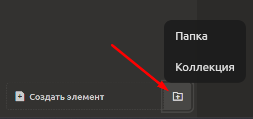
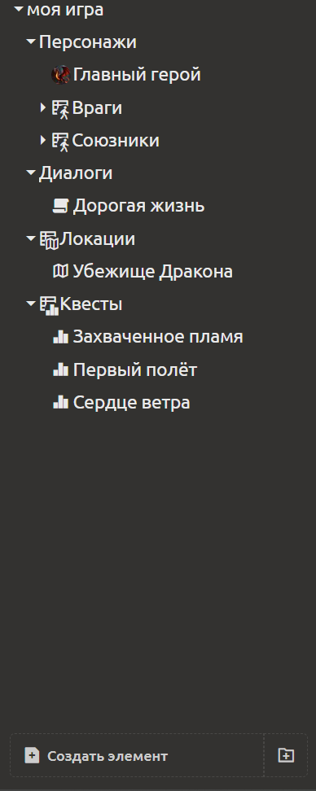

# Организация содержимого

По мере роста проекта количество элементов увеличивается. Для удобной навигации, структурирования и массовой работы с данными в системе предусмотрены два основных инструмента: **папки** и **коллекции**. 


## Папки

Папки предназначены для **группировки любых элементов** (документов, игровых объектов, блоков, сценариев и т.д.) **без ограничений по типу**. В одной папке могут находиться элементы разных типов.

**Создание папки:**
- В левой панели (дереве проекта) нажмите кнопку справа от "Создать элемент" и выберите тип **«Папка»**.
- Задайте имя папки (например, «Персонажи», «Локации», «Диалоги», «Артефакты»).

**Использование папок:**
- Перетаскивайте существующие элементы в папку и обратно.
- Внутри папок можно создавать **вложенные папки** (любая глубина вложенности).
- Папки помогают организовать проект по смысловым разделам, не смешивая разнородные элементы.



## Коллекции

**Коллекция** — это особый вид папки, которая **привязана к конкретному типу элементов** (или к конкретному элементу-образцу). Все элементы, создаваемые внутри коллекции, автоматически создаются как **экземпляры** от этого образца [см. раздел Любой элемент как шаблон (универсальный механизм)](game-objects-and-templates.md#любой-элемент-как-шаблон-универсальный-механизм).

**Как создать коллекцию:**
1. В дереве проекта нажмите кнопку справа от "Создать элемент".
2. Выберите тип **«Коллекция»**.
3. Укажите **исходный элемент** (образец), от которого будут браться структура и содержимое. Это может быть:
   - игровой объект (например, «Базовый персонаж»);
   - текстовый документ (например, «Шаблон квеста»);
   - чек-лист, диаграмма, сценарий, структура, перечисление — любой элемент.
4. Задайте имя коллекции (например, «Команда героев»).

**Особенности работы с коллекциями:**

- **Массовое редактирование** — вы можете открыть коллекцию в виде **таблицы**, где строки — это элементы коллекции, а столбцы — их свойства. Это позволяет быстро менять значения у многих элементов одновременно (например, повысить уровень здоровья всем персонажам в коллекции).
- **Редактирование отдельных элементов** — каждый элемент коллекции можно открыть как обычный элемент и изменить его индивидуально (в том числе добавить уникальные блоки, не влияя на остальных).
- **Автоматическая типизация** — при создании нового элемента внутри коллекции вам не нужно каждый раз выбирать тип; он задаётся коллекцией.
- **Массовое добавление** — можно создать сразу несколько элементов в коллекции, указав только имена.

**Пример:**
1. Создайте шаблон экземпляра «Персонаж» со свойствами `здоровье`, `атака`, `мана`.
2. Создайте коллекцию «Игровые персонажи», привязанную к шаблону «Персонаж».
3. Добавьте в коллекцию трёх персонажей: «Воин», «Маг», «Лучник».
4. Откройте коллекцию как таблицу — вы увидите три строки и столбцы `здоровье`, `атака`, `мана`.
5. Измените значение `здоровье` для всех трёх на 150 — изменения применятся мгновенно.
6. Если открыть "Способности" «Мага» как отдельный элемент, можно добавить ему уникальный блок «Заклинания», не затрагивая других.

::: tip
Коллекции не являются простыми папками. Они требуют указания базового типа/шаблона. Если вам нужна простая группировка без типизации, используйте обычную папку.
:::

Внутри коллекции вы можете создавать папки, они будут также привязаны к типу коллекции

## Рекомендации по организации

Чтобы проект оставался понятным и удобным для сопровождения, следуйте этим рекомендациям:

| Проблема | Решение |
|----------|---------|
| **Разнородные элементы** (черновики, архивы, справочные материалы) | Используйте **папки**. |
| **Однородные наборы элементов одного типа** (список врагов, инвентарь, набор квестов) | Используйте **коллекции** — это упрощает массовое редактирование и контроль целостности. |
| **Слишком глубокая вложенность** | Не создавайте более 3–5 уровней вложенности папок, иначе навигация станет неудобной. |
| **Непонятные названия** | Давайте папкам и коллекциям осмысленные имена, отражающие их содержимое. Избегайте имён вроде «Новая папка». |
| **Нужна дополнительная группировка внутри типа** | Можно создавать папки внутри коллекций — это позволяет группировать элементы, сохраняя привязку к типу. Например, коллекция «Враги» → папка «Боссы» → папка «Моб-боссы». |
| **Проект захламлён неиспользуемыми элементами** | Удаляйте или архивируйте старые элементы, чтобы проект не разрастался и не замедлял работу. |

**Пример комбинированной структуры:**

```
Проект «Dark Fantasy»
├─ Коллекция «Персонажи» (тип: Базовый персонаж)
│ ├─ Герои
│ │ ├─ Воин
│ │ └─ Маг
│ └─ Враги
│   ├─ Гоблин
│   └─ Орк
├─ Коллекция «Квесты» (тип: Шаблон квеста)
│ ├─ Основной квест
│ └─ Побочные
└─ Папка «Архив» (для старых версий)
└─ Устаревшие персонажи
```

Такая организация позволяет быстро находить нужные элементы, эффективно редактировать группы объектов и поддерживать порядок в проекте любого масштаба.