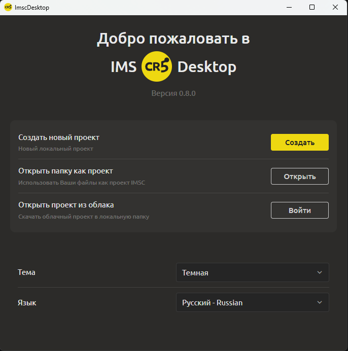
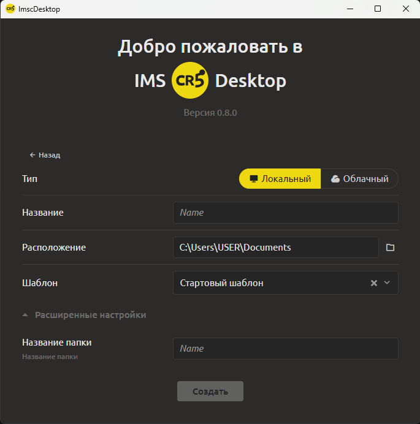

# Создание нового проекта

Для создания нового проекта выполните следующие шаги:

  
  

1. На стартовом экране нажмите кнопку **Создать**

2. Выберите **тип проекта**:

   * **Локальный** – все файлы проекта будут храниться только на вашем компьютере.

   * **Облачный** – проект будет автоматически синхронизироваться с облачным хранилищем [см. раздел Синхронизация с облаком](../main-editor/cloud-sync.md).

3. Введите **имя проекта** (отображаемое название).

4. Укажите **расположение** - директорию для сохранения. По умолчанию предлагается папка «Документы». Вы можете выбрать любую другую папку на диске.

5. Выберите **стартовый шаблон**. Система предлагает несколько предустановленных шаблонов (например, стартовый, RPG, платформер и др.). Вы можете нажать кнопку просмотра, чтобы увидеть содержимое шаблона перед выбором. Если не уверены, оставьте шаблон по умолчанию. Чтобы создать пустой проект, нажмите крестик в поле выбора шаблона

6. При необходимости раскройте блок **Расширенные настройки**. Там вы можете указать отличное от имени проекта **Название папки** – это имя будет использоваться для папки на диске.

7. Нажмите кнопку **«Создать»**.

После создания проекта откроется **главная рабочая область** с уже сгенерированными элементами из выбранного шаблона (например, приветственный текст, объясняющий основной функционал программы). Вы можете сразу приступать к редактированию.