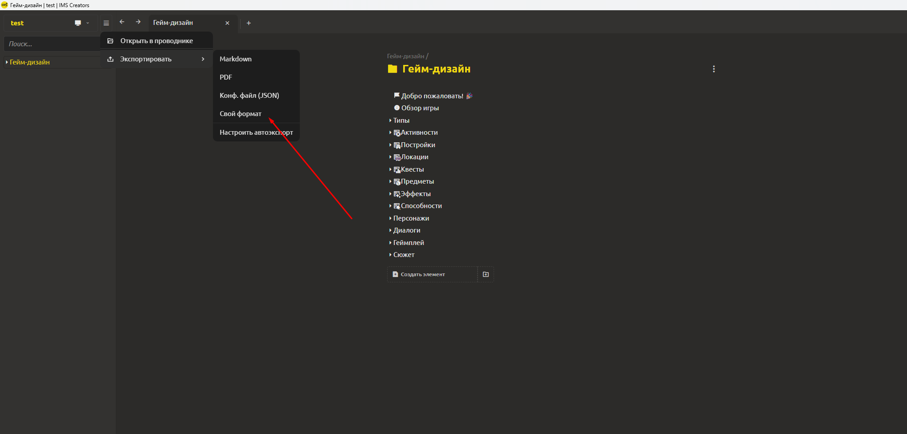
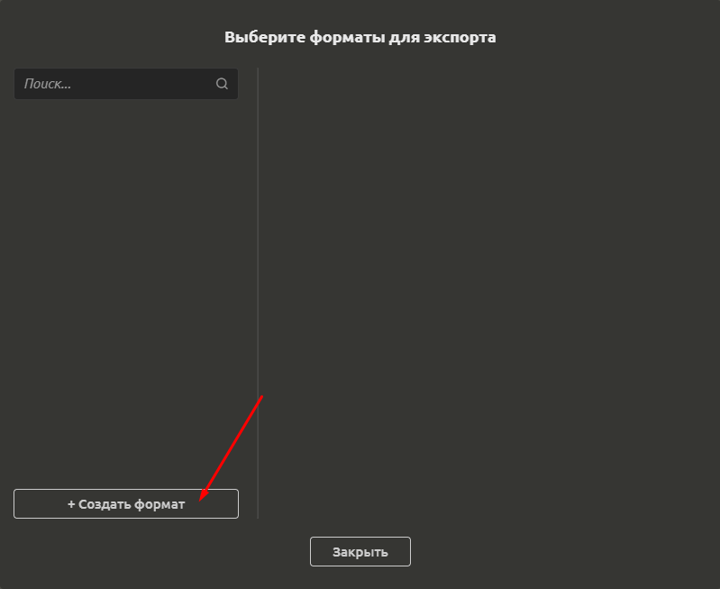
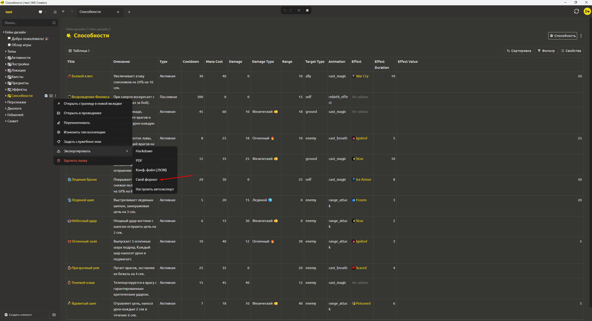
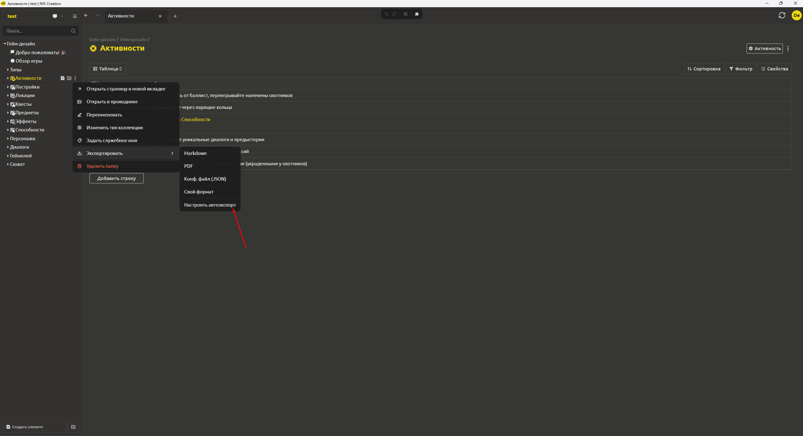

# Экспорт в свой формат

Система позволяет выгружать элементы в различных форматах для дальнейшего использования в игровых движках. Кроме того, можно настроить **автоматический экспорт** – изменения в проекте будут автоматически экспортироваться в указанную папку.

<div align="center">
  
</div>

## Настройка собственного формата экспорта

Если стандартных форматов недостаточно (например, нужен CSV-файл для Excel или кастомный JSON с ограниченным набором полей), вы можете создать **пользовательский формат экспорта**.

### Создание нового формата

<div align="center">
  
</div>

1. В меню экспорта выберите **«Свой формат»**.

2. Нажмите **«Создать формат»**.

3. Введите **имя формата** (например, «Выгрузка персонажей для CSV»).

4. Укажите, к какому **типу элементов** (или конкретному шаблону) применяется этот формат. Например, можно выбрать базовый тип «Игровой объект» или конкретный шаблон «Персонаж». Формат будет доступен только для элементов этого типа.

### Выбор типа выходного формата (CSV или JSON)

**Для CSV:**

* Выберите **поля**, которые хотите экспортировать (из структуры выбранного типа элемента). Например, для персонажа: `health`, `attack`, `name`. Поля могут быть как плоскими, так и вложенными (например, `stats.health`).

* Укажите **разделитель**: запятая (`,`) или точка с запятой (`;`). Точка с запятой рекомендуется, если значения могут содержать запятые.

* Поставьте галочку **«Добавлять заголовки»** – первая строка CSV будет содержать имена полей.

* **(Опционально) Пост-обработка** – JS-код для преобразования данных перед записью ([см. раздел Пост-обработка данных с помощью JavaScript](#пост-обработка-данных-с-помощью-javascript)).

**Для JSON:**

* Выберите один из режимов:

  * **«Полный»** – экспортировать всю внутреннюю структуру элемента (включая служебные поля `id`, `createdAt` и т.д.).

  * **«Только значения»** – экспортировать только содержимое `values` ([см. раздел Поля values и служебные имена блоков](asset-structure.md#поля-values-и-служебные-имена-блоков)). Это самый чистый вариант для движка.

  * **«Выбранные поля»** – экспортировать только конкретные поля (аналогично CSV, но в формате JSON).

* **Группировка в один файл:**

  * Если галочка **включена** – при экспорте целой папки или нескольких элементов все они будут сохранены в **один** JSON-файл (массив объектов).

  * Если галочка **выключена** – каждый элемент сохраняется в **отдельный** JSON-файл (название файла = служебное имя или `id`).

* **(Опционально) Пост-обработка** – JS-код для модификации данных перед сохранением.

### Сохранение формата

После настройки нажмите **«Сохранить»**. Новый формат появится в меню экспорта для выбранного типа элементов.

## Пост-обработка данных с помощью JavaScript

Для гибкой кастомизации вы можете добавить **пост-обработчик** – небольшой JS-код, который выполняется перед записью файла. Код должен принимать объект данных элемента (в формате, соответствующем выбранному режиму) и возвращать преобразованный объект (или примитив, если это CSV-строка).

**Пример для CSV (преобразование полей):**


```javascript
function process(data) {
  // data – объект элемента в плоском виде (поля, выбранные для CSV)
  return {
    name: data.title,
    hp: data.health * 2,      // увеличиваем здоровье вдвое
    attack: data.attack
  };
}
```

**Пример для JSON (удаление служебных полей):**


```javascript
function process(data) {
  // data – полный объект элемента (если выбран режим «Полный»)
  return {
    id: data.id,
    title: data.title,
    stats: data.values.stats
  };
}
```

**Ограничения:**

* Код выполняется в безопасной изолированной среде (песочнице).

* Доступны только стандартные возможности JavaScript (ES2020).

* Вызовы внешних API, работа с файловой системой, сетевые запросы запрещены.

* Код должен быть синхронным и возвращать значение.

## Выгрузка с использованием пользовательского формата

<div align="center">
  
</div>

1. Выберите один или несколько элементов (или целую папку) в дереве проекта.

2. Щёлкните правой кнопкой мыши → **«Экспорт»** → выберите ваш сохранённый формат.

3. В диалоговом окне укажите **папку назначения**.

4. Нажмите **«Экспортировать»**.

Система создаст файл(ы) в указанном формате в выбранной папке. При экспорте папки с включённой группировкой будет создан один файл, содержащий массив всех элементов.

## Автоматический экспорт

<div align="center">
  
</div>

Чтобы не экспортировать вручную каждый раз после изменений, можно настроить **автоматический экспорт**:

1. Нажмите на кнопку **Настроить автоэкспорт** в меню

2. В открывшейся форме создайте одну или несколько конфигураций экспорта

3. Нажмите кнопку "Экспорт" и выберите папку

4. Включите галочку "Экспортировать автоматически"

После этого **любое изменение элемента** (или элементов внутри папки) будет **автоматически** записываться в те же файлы в указанной папке. Экспорт происходит в фоновом режиме сразу после сохранения изменений в проекте.

**Пример использования:**

* Вы настроили CSV-формат для выгрузки всех персонажей.

* Включили автоматическую синхронизацию в папку `D:\GameProject\Characters`.

* Ваш игровой движок отслеживает изменения в этой папке (например, через `FileSystemWatcher` в C# или таймер перечитывания в C\+\+).

* При каждом изменении здоровья персонажа в редакторе CSV-файл обновляется – и игра сразу использует новое значение без перезапуска.

> [!TIP]
> Автоматическая синхронизация идеально подходит для итеративной разработки – вы правите данные в удобном редакторе, а движок мгновенно получает обновления без дополнительных действий.

## Рекомендации по интеграции с движком

* **Для CSV** – удобно экспортировать табличные данные (списки предметов, параметры персонажей). Движок может загружать CSV как простые таблицы. При этом используйте пост-обработку для приведения типов.

* **Для JSON** – рекомендован для сложных иерархических данных. Используйте режим **«Только значения»** или **«Выбранные поля»**, чтобы не захламлять движок служебными ID и датами.

* **Автоматический экспорт** – настройте её на папку, которую движок мониторит. Это позволит перезагружать данные на лету.

* **Пост-обработка** – помогает адаптировать данные под конкретный API движка: переименовать поля, объединить значения, рассчитать производные параметры, фильтровать ненужные элементы.

* **Производительность** – избегайте экспорта огромных коллекций в один файл, если движок перечитывает его целиком. В таких случаях используйте режим «отдельные файлы» или разбивайте данные на несколько форматов.
