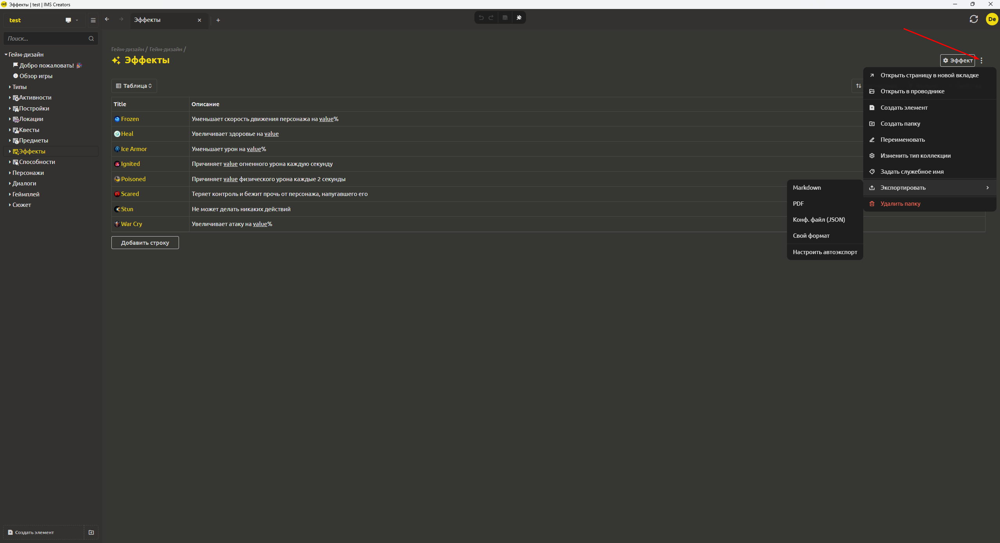

# **Экспорт**

Щёлкните правой кнопкой мыши по любому элементу (или нажмите на три точки рядом с ним) и выберите **«Экспорт»**. Доступны следующие варианты:

* **Markdown (.md)** – экспорт в текстовый формат с разметкой Markdown. Удобно для публикации документации или вставки в вики.

* **PDF (.pdf)** – экспорт в документ PDF (сохраняет форматирование, подходит для печати и распространения).

* **JSON (.json)** – экспорт в нативный формат системы (полная копия внутренних данных, совпадает с форматом хранения на диске).

> **Важно:** JSON-формат полностью совпадает с внутренним представлением элемента. Его можно использовать для резервного копирования, импорта обратно в систему или для интеграции с движками, поддерживающими чтение JSON. Если стандартного JSON недостаточно, создайте **экспорт в свой формат** — [см. раздел «Экспорт в свой формат»](../integration/export-format.md).