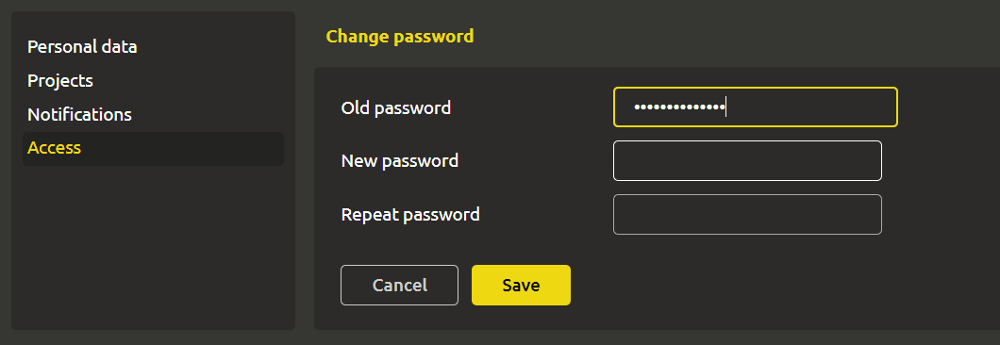

# Changing the password

To change the password, go to the `Profile` -> `Access` tab. To do this, click on your name in the upper right corner and click `Profile` in the drop-down list. The `Access` section will be located in the left menu.

Enter `Old password`, `New password` and repeat the new password.

