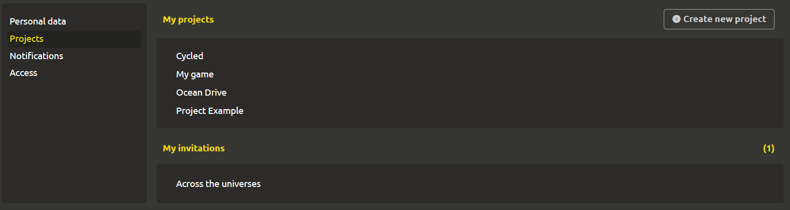

# My projects and invitations

To manage projects, go to the `Profile` -> `Projects' tab. There are 2 sections here.

# My projects

To create a new project, click on the `+ Create new project` button in the upper right corner. To go to an existing project, click on it.

# My invitations

Here you can see your invitations to projects. A list of projects is indicated. Clicking on 1 of them opens a dialog box confirming acceptance of the invitation.

::: tip
Detailed information on creating invitations for new participants can be found in the "Teamwork" section
:::