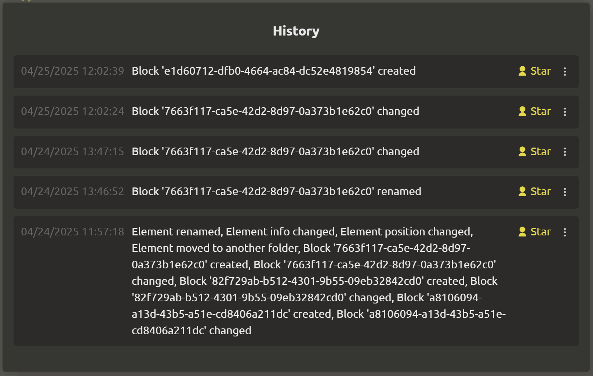
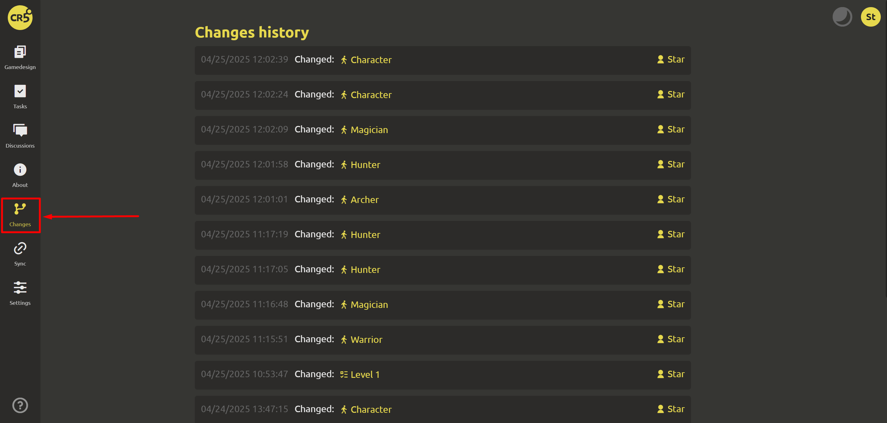

# Change history

## Changes of the selected element

To view the changes, click on the 3 dots in the upper right corner of the element and click on `History`.

::: tip
You can mark the changes. If you want to undo several changes, undo them one by one!
:::

## Changes of the entire game design document

After a long break, it is very difficult to remember where you left off? Now this problem will no longer arise! The main thing is to remember the path. In the left menu “Changes”. You can click on the element and continue working from where you left off.

The change history will be a great solution if participants need to know what changes were made.