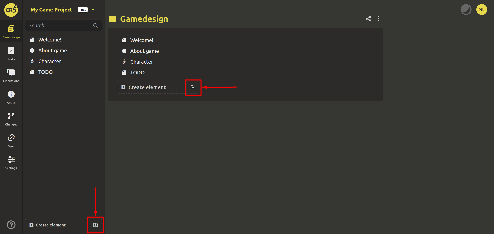
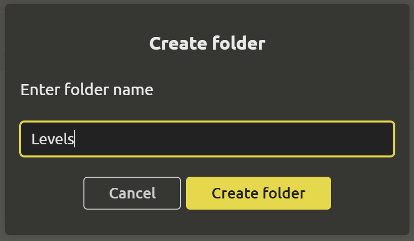
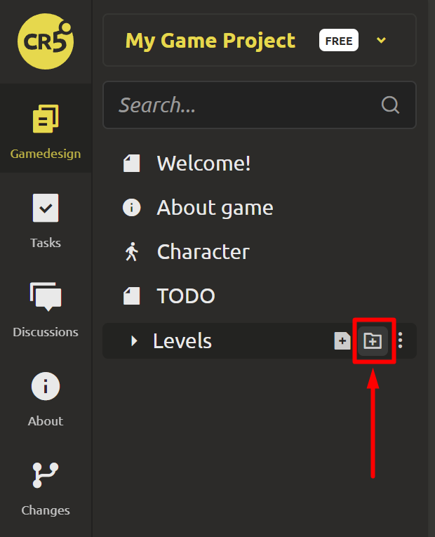
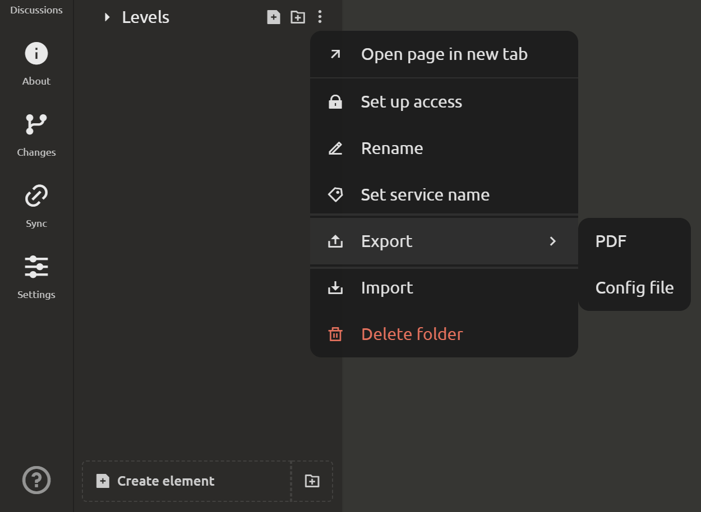
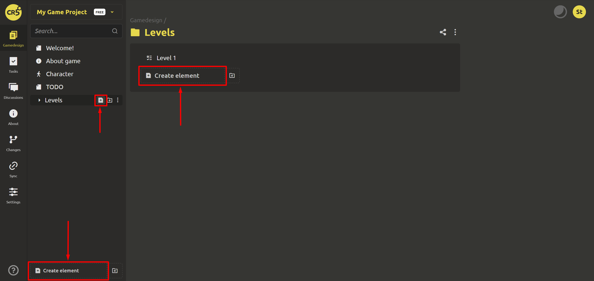
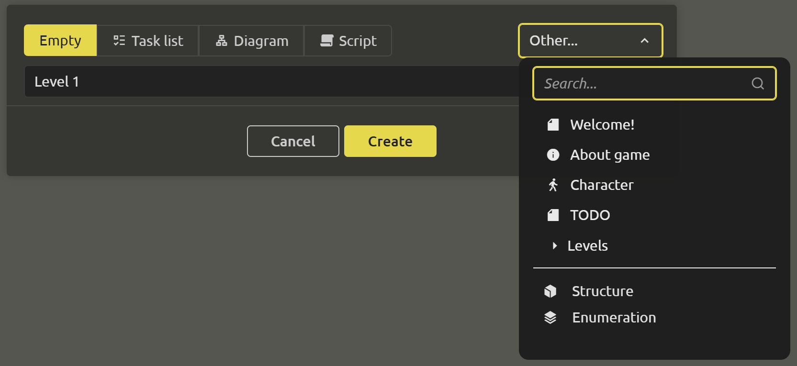
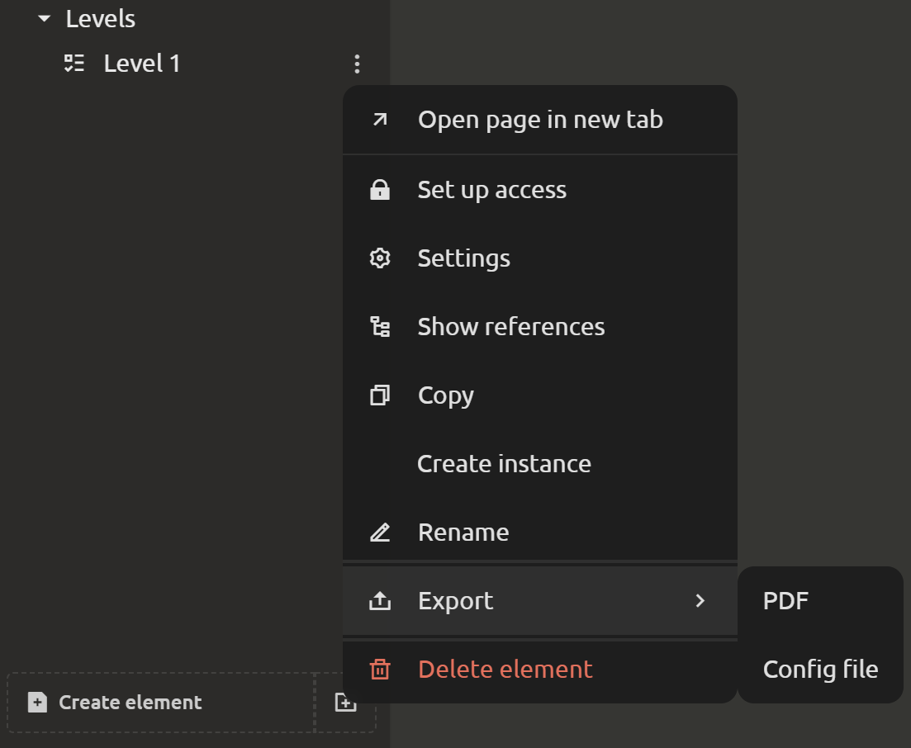

# Creating document sections

A game design document should be well organized. To navigate it quickly and easily, use folders and elements.

## Creating folders

Go to the “Game Design” tab. At the bottom of the left menu there is a button with a folder icon. Click on it to create a folder.

After that, a dialog box will open where you need to enter the name of the new folder.

Great. The folder is created! IMS Creators has a multi-level structure. To create subfolders, hover over the folder you are interested in and click on the folder icon.

To edit folders, use the drop-down list in the form of 3 dots:

## Create elements

Go to the “Game design” tab. At the bottom of the left menu there is a button `Create element`. Click on it if you want to create an element in the root of the game design document. If you need to create an element inside a folder, then hover the cursor over the desired folder and click on the icon with the file.

After that, a dialog box will open where you need to enter the name of the new element and select the element type:
1. **Task list**. It is perfect for storing a list of tasks within a sprint. It can also act as a list of tasks grouped by a certain criterion (for example, a list of bugs or, conversely, a list of ideas for implementation in future versions).
2. **Diagram**. It will fit perfectly into a game design document if you need to draw something or reflect it on a diagram.
3. **Scenario**. Every game has a beginning and an end. And between them there is some kind of plot. There are different possible outcomes of events, which are best designed as scenarios so as not to get confused in the plot lines. Information on how to use it can be found [here](../gdd/editing-elements.md).
4. **Custom**. You can create your own elements and types, and create new ones based on them! How it works is described in detail in the [Element Templates](../gdd/element-templates.md#creating-a-template) section.
5. [**Structure**](../gdd/structures-and-enums.md#structures).
6. [**Enumeration**](../gdd/structures-and-enums.md#enumerations).

For example, if you select the `Task List` type, an element with a `Checklist` type block will be created. Other types work similarly.

Great. The element is created! To edit the element, use the drop-down list in the form of 3 dots:

## Moving Folders and Elements

To move, click on a folder or element and, without releasing it, drag it to the desired location.