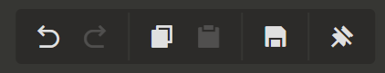
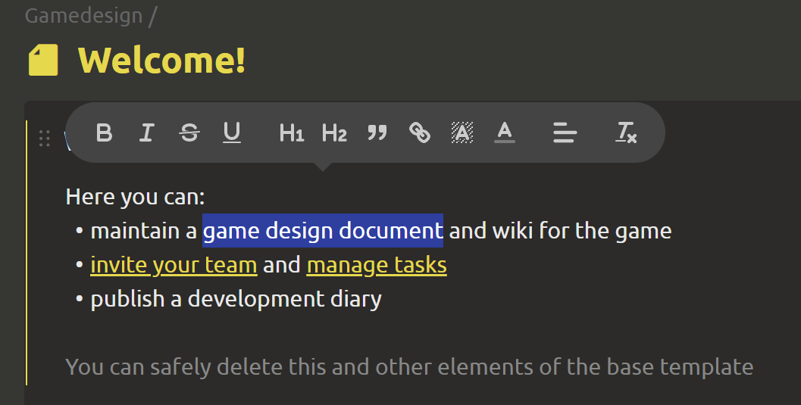
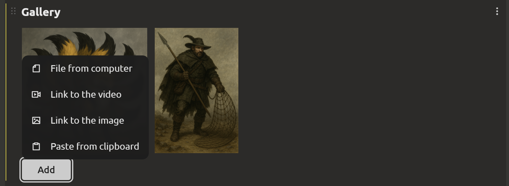
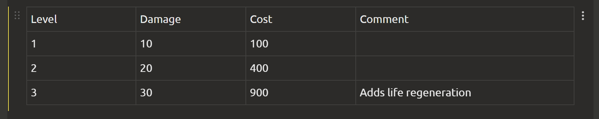
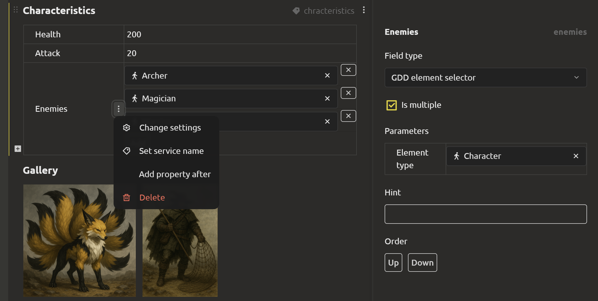
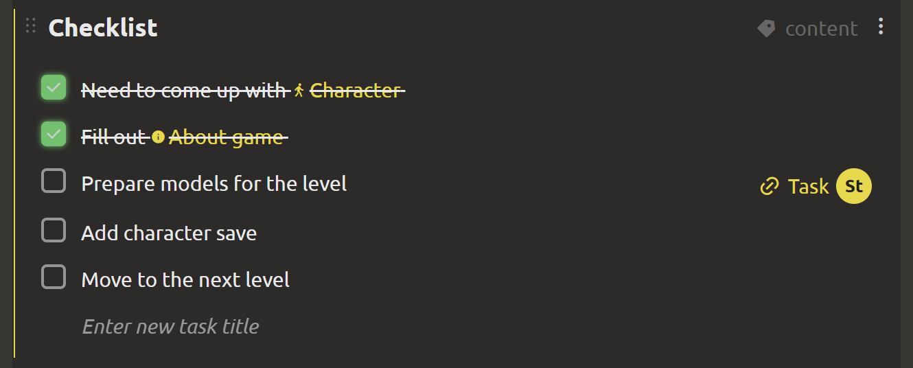
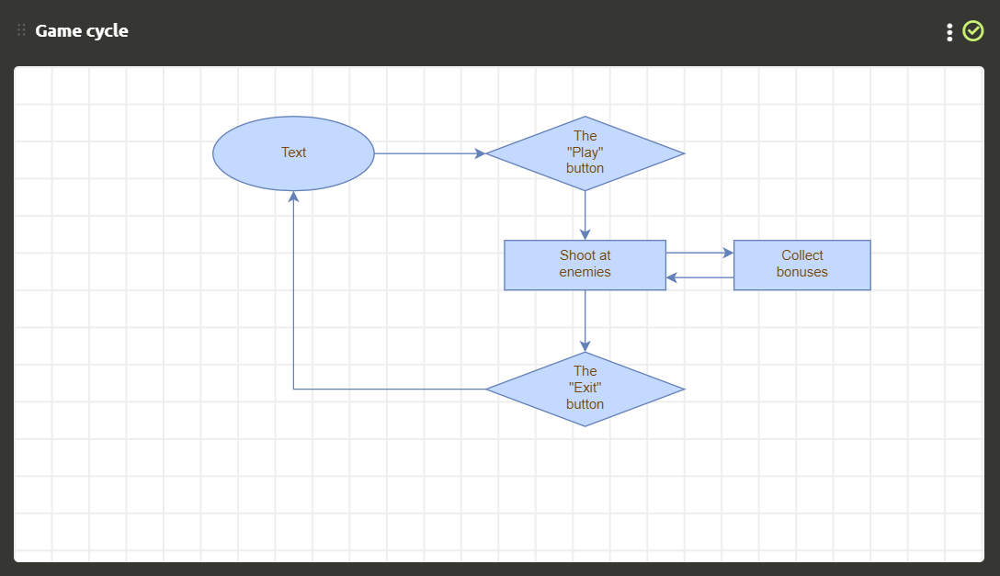
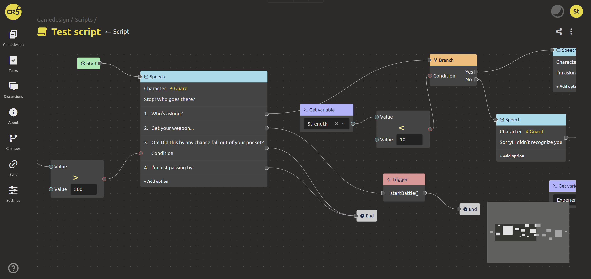
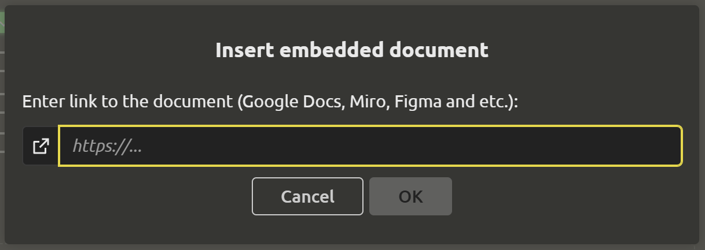
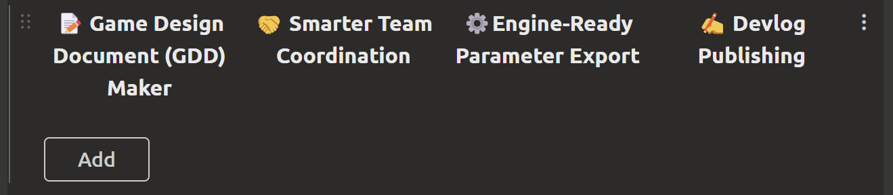

# Editing elements

## Editing blocks

You can create different types of blocks inside elements:

- [Text](#block-text)
- [Gallery](#gallery-block)
- [Value table](#block-values-table)
- [Property table](#block-properties-table)
- [Checklist](#checklist-block)
- [Diagram](#block-diagram)
- [Script](#script-block)
- [Embedded document](#block-embedded-document)
- [Grid text](#block-text-grid)

::: tip
You can use links to project elements inside each of these blocks. To do this, enter "#" or "@", and then select the element from the drop-down list.
:::

## Editing panel

The editing panel will become an indispensable assistant when you need to:
- ↩️ Undo change
- ↪️ Redo change
- 📃 Copy block
- ➕ Paste block
- 🗃️ Save changes

::: tip
By clicking on 📌, you can pin/unpin the editing panel.
:::

## Block “Text”

In the `Text` block, you can place text, images and GIFs. Using the editor, you can format the text:
- "Bold" (`Ctrl + B`)
- "Italic" (`Ctrl + I`)
- "Strikethrough"
- "Underlined"
- "Heading 1"
- "Heading 2"
- "Quote"
- "Link"
- "Background"
- "Color"
- "Text alignment"
- "Clear format"

## Gallery Block

In the Gallery block, you can add files from your computer (pictures and videos) and links to videos. To add, use the `+` located inside the block. You can manage the order of pictures by grabbing one of the elements and dragging it to the desired location.

## Block “Values table”

You can add rows and columns in the `Values ​​table` block.

## Block “Properties table”

There are 2 columns in the `Properties table` block. The left column is for entering the property name, and the right column is for specifying the value. To add a new property, you can click on the `+` to the left of the property name or on the dots to the right and `Add property after` in the drop-down list. To delete, click on the dots and select the appropriate item.

You can `Change settings` of the properties by clicking on the dots to the right. A tab will open on the right with a selection of parameters:
- `Field type`. The field can be of the following types: `String`, `Number`, `Text`, `Checkbox`, `Date picker`, `File picker`, `Structure`, `Enumeration`, `Enumeration(radio buttons)`.
- `Is Multiple`. If the property can have multiple values, then you need to check the box.
- `Order`. Contains 2 buttons: `Up` and `Down`, used to change the order of properties.

::: tip
You can create composite fields using elements with the "Structure" type. More details on how to create them [here](structures-and-enums.md#structures-and-enumerations).
:::

## "Checklist" block

In the `Checklist` block, you can place tasks that need to be completed.

To create a new task, press `Enter`.

If the task is quick to complete, then after completing it, you can mark it with a green checkmark by clicking on the gray circle on the left.

If the task is important and takes a lot of time, you can place it on the task board. To do this, click on the `+ Create task` button that appears when you hover over one of the checklist items. In the window that opens, you can configure the task parameters.

::: tip
More about tasks in the next section.
:::

## Block "Diagram"

In the `Diagram`, you can add text, rectangles, ovals, diamonds and other shapes, connecting them with arrows.

With the help of diagrams, you can clearly present:

- a tree of skills/improvements/technologies,
- storyboards,
- a sequence of stages or chapters of the game,
- a demonstration of the game cycle.

Moreover, you can insert not only text into the nodes of the diagram, but also links to other elements of the game design document using # or @. The result is an interactive map that will make it easier to navigate the document.

Like other blocks, flowcharts can also be inserted into tasks, which will help you set them correctly, describe the necessary algorithms, sketch out the architecture, and much more.

There is a high probability that you will like the graphic editor so much that you will no longer want to leave IMS Creators to put your thoughts on the shelves.

## “Script” block

In the “Script” block, you can maintain a storyline, create branched dialogues, and develop in-game scripts.

## Block “Embedded document”

The following can act as an embedded document: Google tables, Google documents, YouTube. To create a block, you must enter a link to the document and the name of the document.

You can work with the document without leaving IMS Creators. All functionality is preserved.

## Block "Text grid"

In the block "Text grid" you can break the text into columns.

