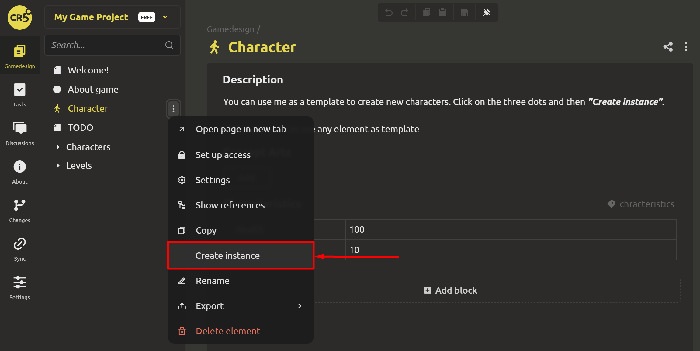
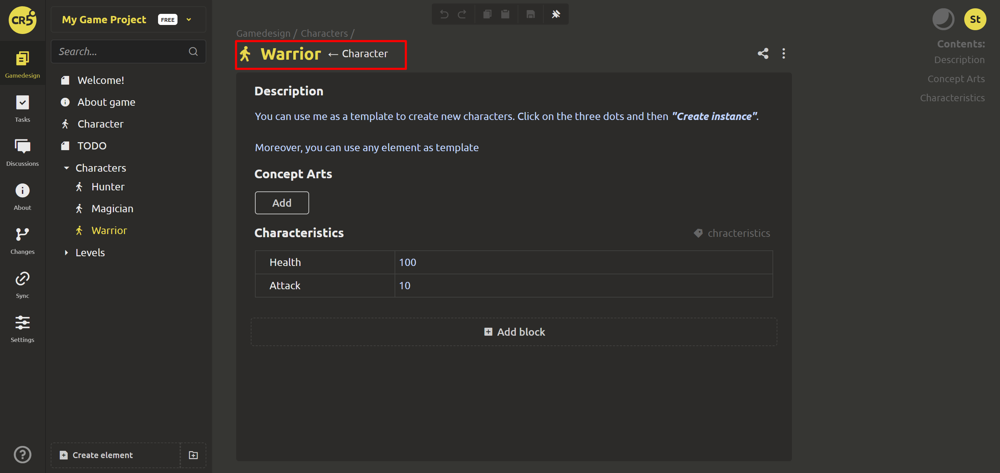
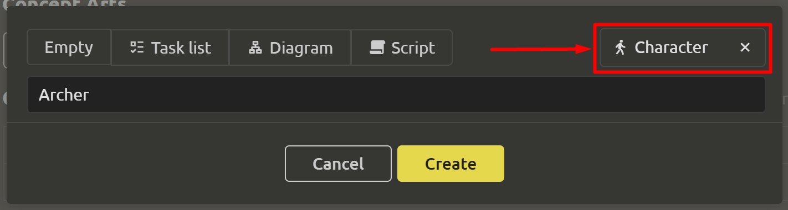

# Element Templates

## Creating a template

Any element you want can become a template. The good news is that you don't have to do anything for this 😉

## Creating an instance

Instances can be created in 2 ways:
1. Through the parent element menu.
When creating an instance, the new element becomes a child, and the original element becomes the parent. When editing the parent element, the changes are automatically transferred to the child elements.

You can tell that the element was created using a template by the block with the name. The arrow after the name points to the parent. To quickly go to the parent element, you need to click on it.

You can create multi-level inheritance chains by inheriting elements from children.

2. When creating an element. In the dialog box for creating an element, you can select a parent. For more information about the basic parent elements already provided in the system, read [here](creating-doc-sections.md#creating-elements).

