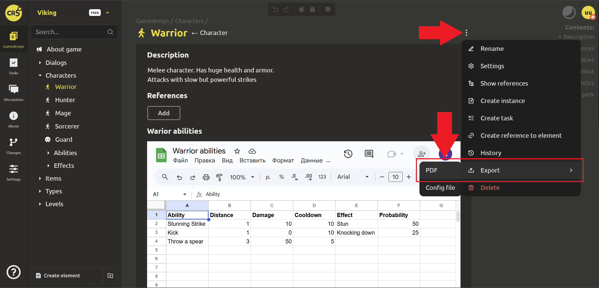
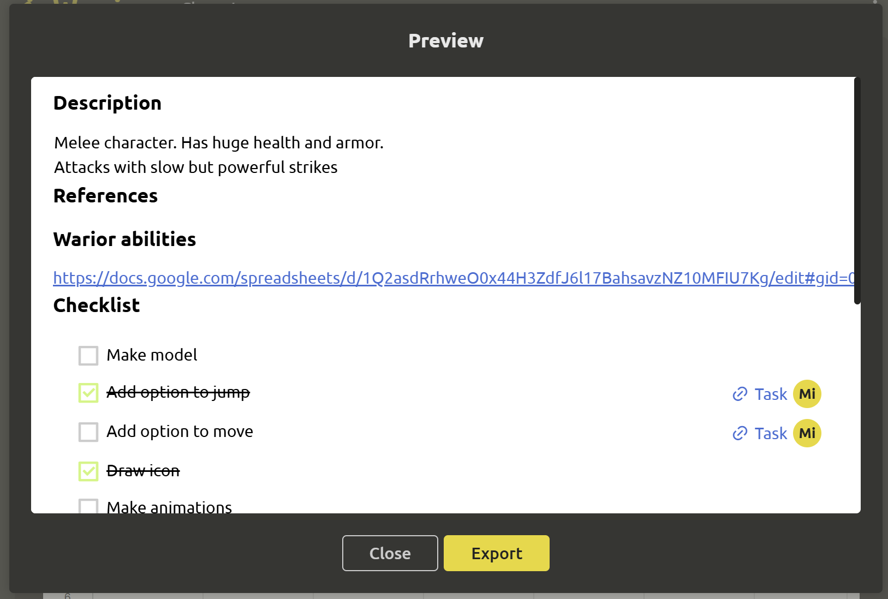
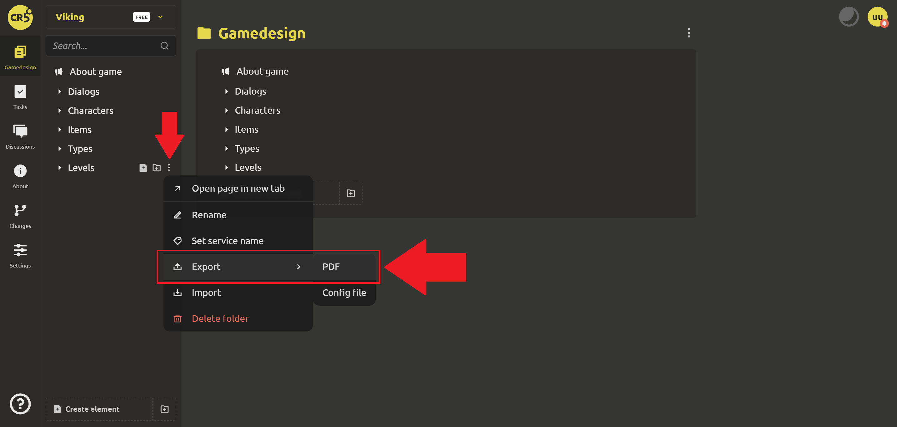
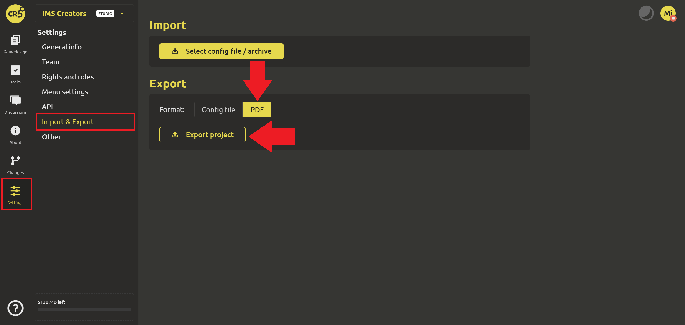

# Import and export

## Export

In IMS Creators, you can export to PDF:

1. A separate element. To do this, select the `Export` command and the `PDF` format from the menu in the upper right corner or in the “Game Design” tab.

A preview window will appear. After checking that everything is correct, click `Export`.

2. A folder. You need to perform the same actions.

3. The entire project. Go to the “Settings” tab -> “Import/Export”.

Similarly, you can [export configuration files in JSON format](../integration/export-config-files.md) for use in engines or when importing.

## Import

In IMS Creators, you can import config files. To do this, select the `Import` command in the menu in the upper right corner or in the “Game Design” tab and find the desired archive.