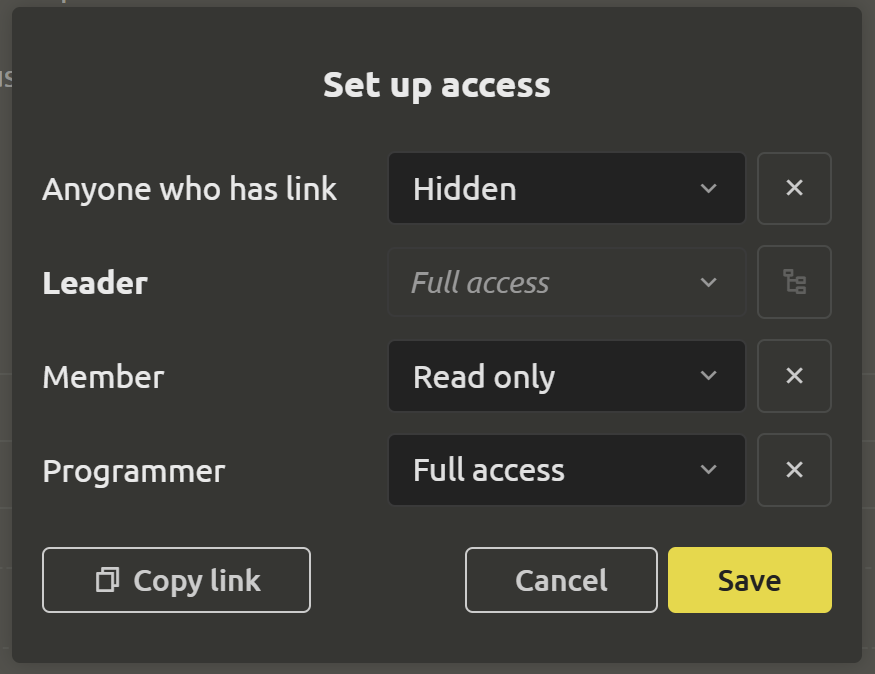

# Setting up access

Share links to tasks, files and even folders without worrying about data loss or leakage. In order to do this safely, only the project leader can set up access rights to individual tasks, files and folders.

## Creating a link for access

In the menu, next to the 3 dots, there is a “Share” icon. When clicked, a dialog box opens where you can select access to the element opposite each role. At the moment, 3 options are available: “Hidden”, “Read only” and “Full access”.

## Setting up access by roles

If you need to change access, then when clicking on the 3 dots, select the `Set up access` item. You can assign each participant their own role. More details about roles and rights [here](../project-settings/rights-and-roles.md#rights-and-roles).