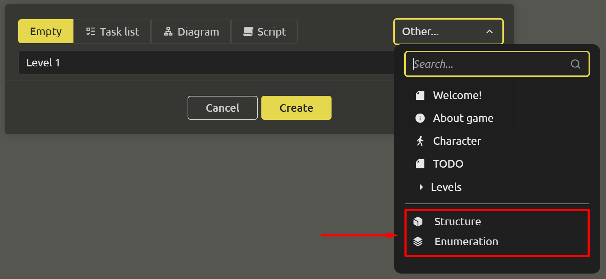
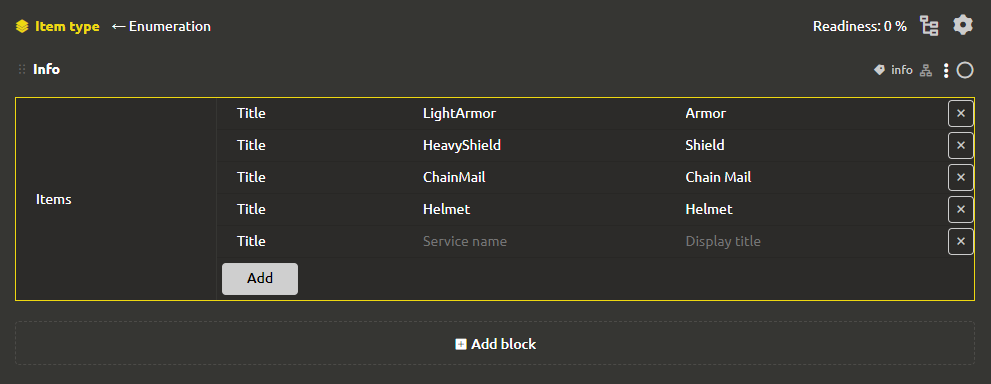
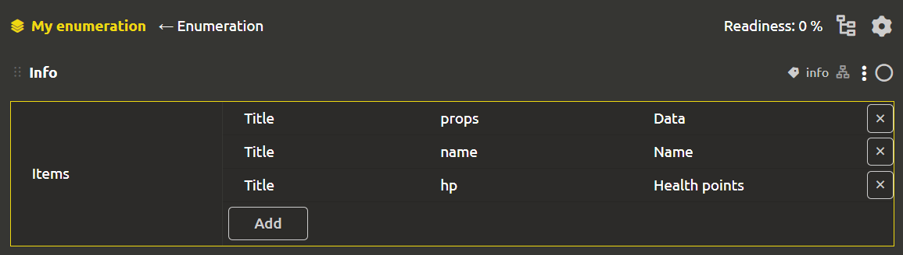
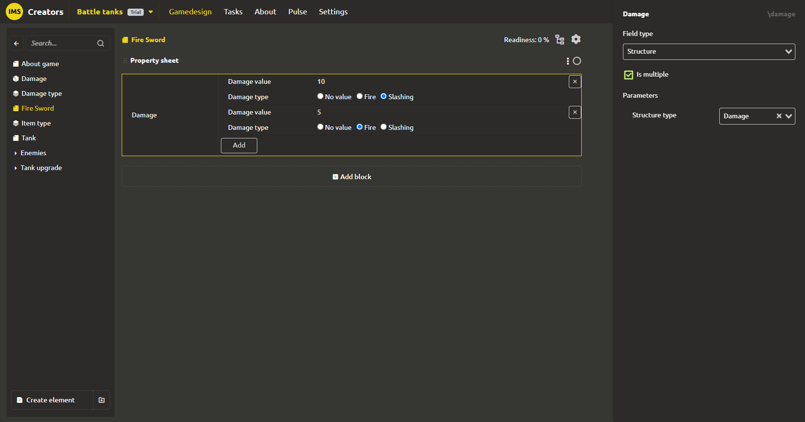
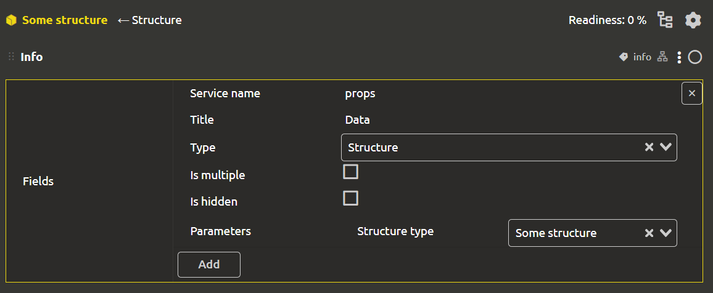

# Structures and enumerations

To create a structure or enumeration, you need to create an element with the corresponding type. To do this, in the element creation window, click on the button in the upper right corner `Other` and select `Structure` or `Enumeration` in the drop-down list.

## Enumerations

The 'Enumeration` type allows you to create a list of values, which can then be used when filling in the properties of elements.

For example, the game has an inventory with items. An item can be one of the following types: “Armor”, “Shield”, “Chain mail”, “Helmet”, etc. So that when filling out information about another item, you do not accidentally typo (and do not come up with another new type), you can create an enumeration "Item type" and link it to the "Type“ field the subject.

You can make a choice either through a drop-down list (if there are many options) or through switches (“radio-buttons”).

You can place a list of items inside an enumeration. Each field has the following parameters:
- `Display title`
- `Service name`

## Structures

Let's imagine that there can be different types of damage in the game. When setting characteristics, it is not enough to specify the damage value, it is necessary that it is also indicated what kind of damage it is. Let's wind it up even more, let's say you can deal different types of damage at the same time, for example, 10 slashing damage and 5 fire damage. This is where multiple structures come in handy.

Let's create “Damage” structure and add two fields there: “Damage value” (number) and “Damage type” (enumeration).

Now we can set the damage to the “Fire Sword” item as a multiple field with the “Damage Structure” type and set two values there: 10 slashing damage and 5 fire damage.

You can create fields inside the structure. Each field has the following parameters:
- `Service name`
- `Title`
- `Type`. The type can be absolutely anything (number, text, date, file... and even a GDD element).
- `Is multiple`
- `Is hidden`

