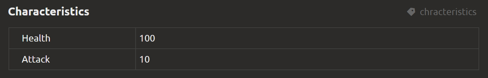

# Export configuration files

Elements are exported to JSON [of the following structure](config-file-structure.md).

We recommend assigning service names to important blocks. Then their values ​​will be inserted into the `values` field of the object. The structure of the field depends on the block type

For example, you are creating a description of a character that you want to set two attributes for: `health` (lives) and `attack` (attack strength). To do this, create a "Properties table" block with two fields:



Give it the service name `chracteristics`. Then in `values` the element will have:

```json
   "values": {
      "characteristics": {
         "health": 100
         "attack": 10
      },
   },
```

::: tip
To assign a service name to a block, click on the three dots on the right side of the block
:::

Please note that the field name you entered was "normalized": uppercase letters were replaced with lowercase, service characters were removed, spaces were replaced with underscores

::: warning
Please note that by default, all fields in the table are not typed, so depending on what is entered in the field, you can get different types of values ​​in JSON. To prevent this, set the desired type in the field settings
:::