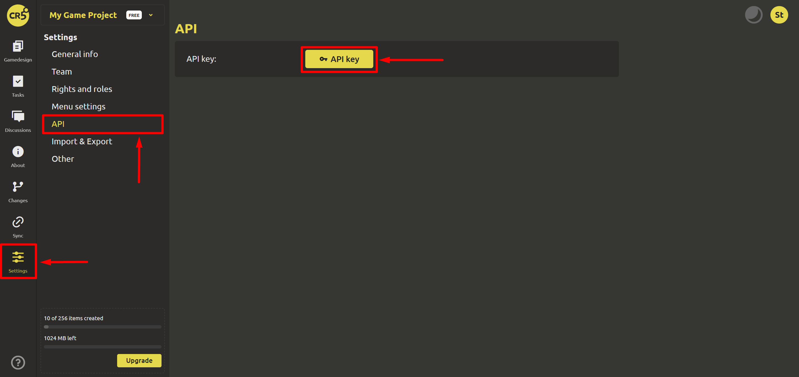
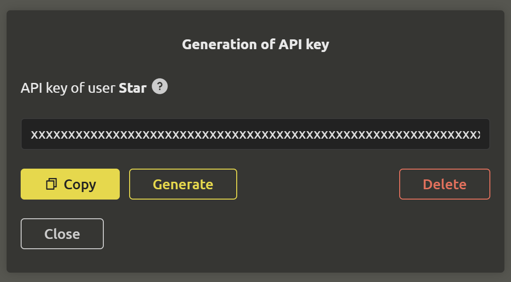

# API

::: tip
This function is only available to holders of the "**Studio**" license. You can purchase a license [here](https://ims.cr5.space/app/prices).
:::

API is needed for quick login to the application. To generate it, go to the "Settings" section and select "API". Click on the `API key` button.

A dialog box will open where you can generate a new API key, copy or delete an existing one.

