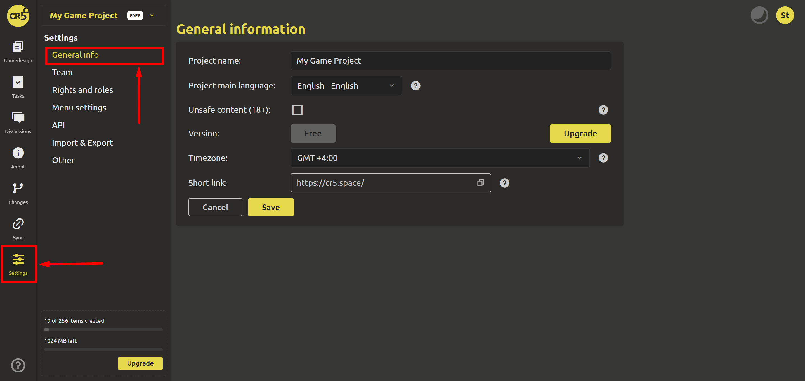

# General Information

To change the general information about the project, go to the “Settings” section and select “General Information”.

1. **Project name**
   This field contains the name of your project. You can change it by clicking on the field and entering a new name.

2. **Project main language**
   This displays the primary language in which the project was created. If you need to change the language, select the appropriate option from the drop-down list.

   ::: tip
      The primary language is used to generate heartbeat events and affects the regional output of the general list of projects
   :::

3. **Unsafe content (18+)**
   This section indicates whether the project contains adult content. If the project includes such content, check the box. Otherwise, leave the field blank.

4. **Version**
   This displays the current license of the project. You can improve it by clicking on the corresponding button.

   ::: tip
      Available licenses can be found [here](https://ims.cr5.space/app/prices).
   :::

5. **Timezone**
   This is the default time zone for the project. Set the time zone in which the project operates.

6. **Short link**
   Enter or paste a short URL to your project. This will allow you to choose a memorable URL for your project.

Click the `Cancel` button if you want to discard the changes you made and return to the previous settings. Click `Save` to save all the changes you made in the "General Information" section.