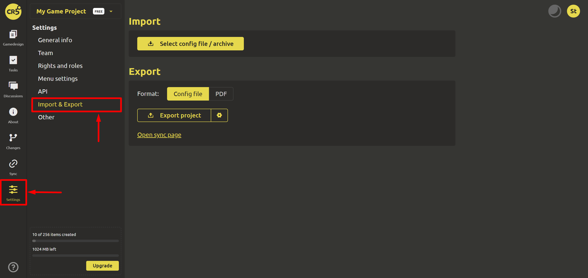

# Import/Export

To quickly start working or save/restore a backup copy, you can use the project export/import function. To do this, go to the "Settings" tab and select "Import/Export".

You can export a project in 2 formats:
1. [Configuration file](../integration/export-config-files.md)
2. [PDF](../gdd/import-export.md#export)

When exporting as a configuration file, you can set the following settings:
- Use names
- Keep folder structure

A preview is available when exporting to PDF.

When importing, you must select a configuration file/archive.