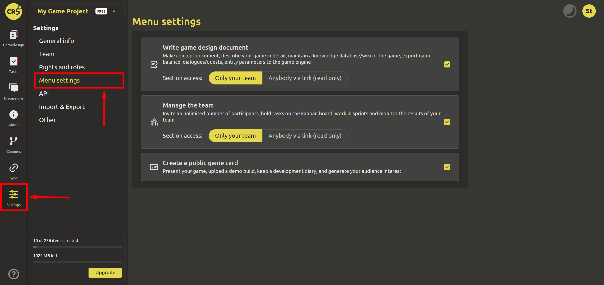

# Menu settings

Depending on the purpose of use (maintaining the GDD, managing the team, creating a public game card, or maybe all together) when creating a project, you set which menu sections to show and which not. In the "Menu settings" section, you can change your choice.

If you want to add a section, then check the corresponding box.

Here you can also change the publicity of the selected sections:
- Only for the team
- Anyone by link (read only)

The current publicity status is highlighted in color.