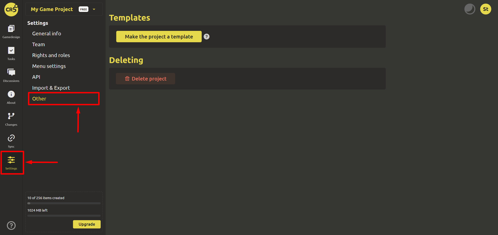

# Other

In the "Settings" section, click on "Other".

Here you can `Make the project a template` by clicking on the corresponding button.

::: warning
Attention! The action is irreversible.
:::

Templates allow you to specify the structure of elements that will be automatically created when using this template. If you want an element to be used as a base, but not to create an instance of it right away, mark it as abstract in the element settings.

When updating elements in a template, the changes are automatically transferred to projects that are based on this template, but new instances will not be created automatically. In order for the structure to be recreated, you must click the `Recreate template structure` button in the project created based on the template.

If you want to delete an accidentally created project, you can `Delete project`.

::: warning
Attention! The action is irreversible. To confirm deletion, enter the name of the game project in the field below.
:::