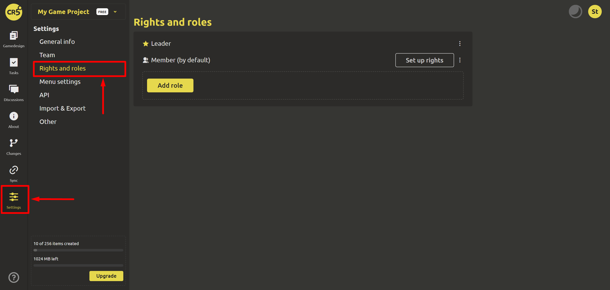
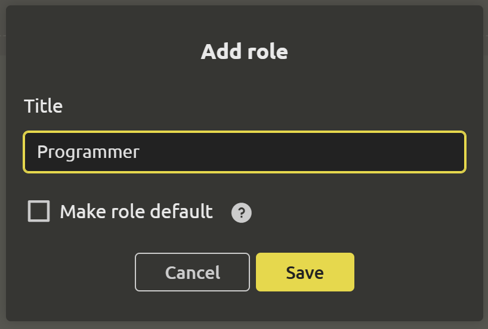
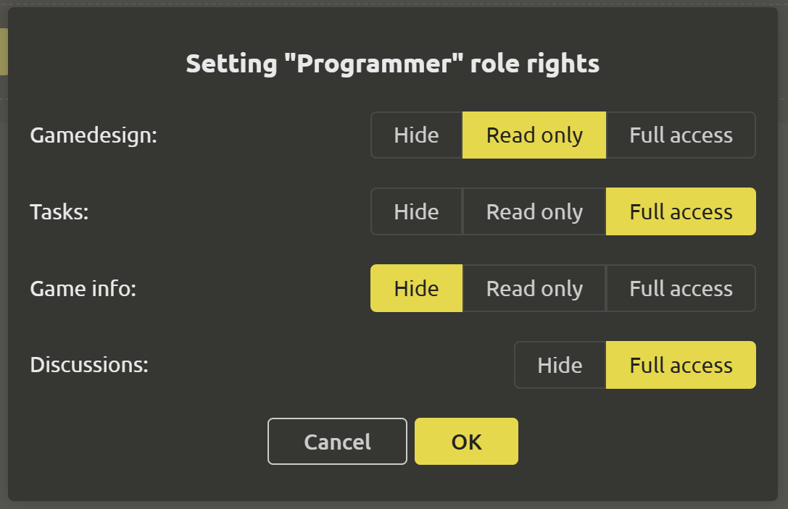

# Rights and roles

Each participant plays a role in the project and has certain rights. In order to restrict access to some sections of the game project, you can create roles and configure rights (using the `Set up rights` button).

To create a role, use the `Add role` button. When adding a role, in the dialog box that opens, you must specify the name of the role and, if necessary, check the box "Make role default". If you set a role as default, all new project participants will have this role.

After creating a role, you need to specify the access level (`Hidden`, `Read only`, `Full access`) to the following sections:
- Game design
- Tasks
- Game information
- Discussions

