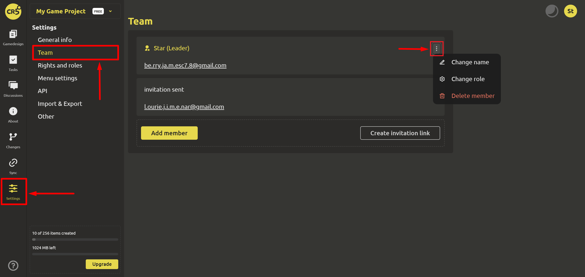
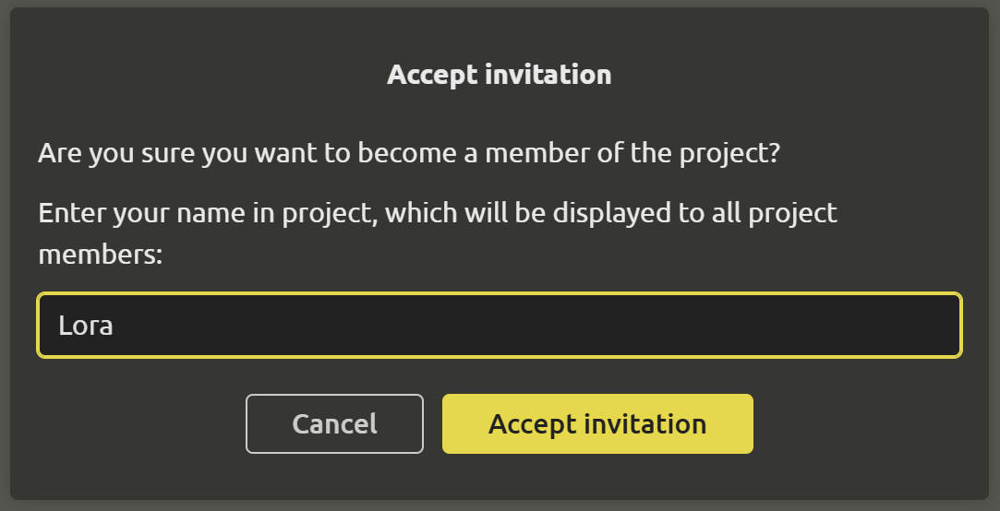

# Team

To manage members, go to the “Settings” section and select “Team”.

You can [both add new members](../start/invitation-to-team.md#invitation-to-team) and remove them using the drop-down menu.

When accepting an invitation, new members are given the opportunity to choose a name in the project, which will be shown to all project members.

Using the drop-down menu, you can change the name, as well as the role. More information about roles can be found [here](./rights-and-roles.md#rights-and-roles).