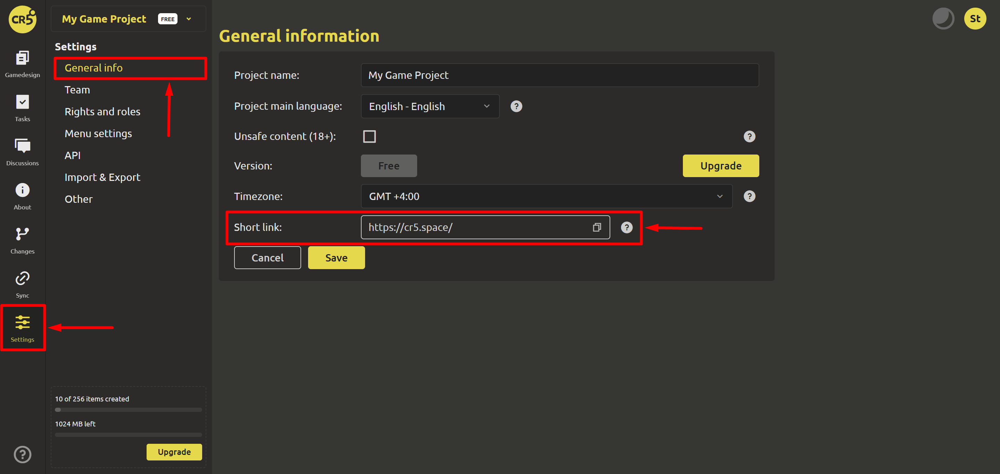

# Development diary

## Creating posts

To create posts, go to the `Pulse` page. And at the top, instead of `What's new?`, add text. And using the buttons on the right, add pictures and links to videos to make a slider. After the post is ready, click the `Submit` button.

To edit or delete a post, you can use the menu in the upper right corner of the post, selecting the appropriate item. Users can leave reactions to a particular post by clicking on the smiley and selecting the desired one.

## Inviting players to your page

For projects with INDIE and STUDIO licenses, it is possible to work with a short link. On the `Settings` -> `General information` tab, the leader can create a short and memorable link for the project.

By clicking on the link, your potential players will see only the sections that are marked with check marks.