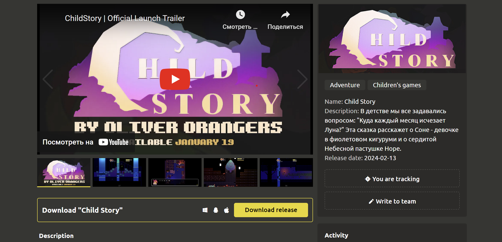
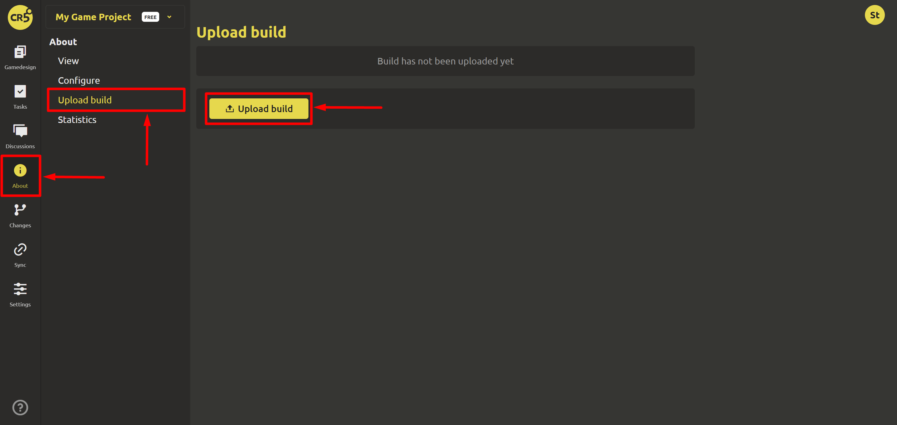
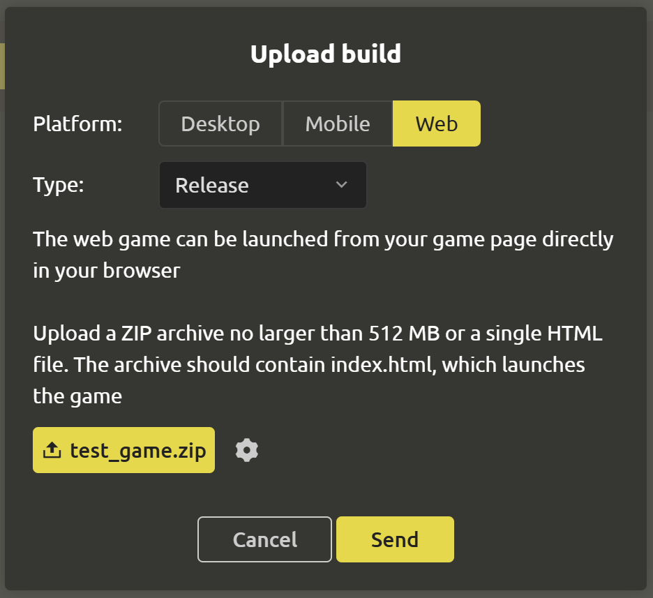
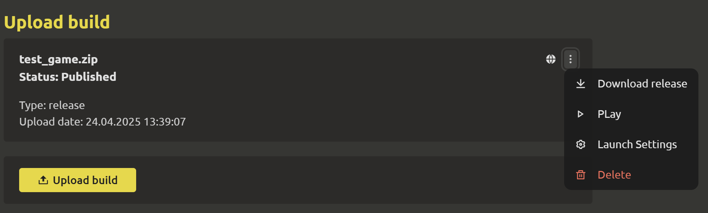
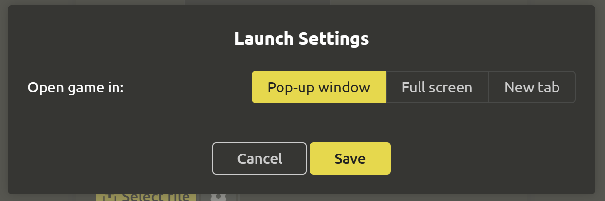

# Publishing a build

If your game is already viable, then it is worth showing to the world) To further attract your players, you can upload a prototype, demo, and even a release of the game to the “About the game” page.

## Downloading a build

::: warning
Only the **Leader** of the team can publish builds.

:::

To do this, the team leader needs to go to the `About the game`->`Download build` section and click the `Download build` button.

After which a dialog box opens where you need to select a platform, stage of readiness (type), file, and other settings. After filling in, click the `Submit` button.

::: warning
You can only have one build uploaded at a time. After you upload a new build, the old one is automatically deleted
:::

## Build Technical Requirements

| Platform | Desktop | Mobile | Web |
| --------------- | --------- | --------- | --- |
| Accepted Types | “Prototype”, “Demo”, or “Release” | “Prototype”, “Demo”, or “Release” | “Prototype”, “Demo”, or “Release” |
| Operating System | Windows, Linux Mac | Android | – |
| File Size | no more than 5 GB | no more than 5 GB | max 512 MB |
| Allowed file extensions | .zip | .apk | .zip .html |

## Checking the build for Web

You can upload games for your computer, mobile (APK for Android) and even web. If you upload a build for web, you can test the game right away. To do this, open the build menu and click on the `Play` item. A full-screen dialog box will open, which can only be closed using the cross in the upper right corner.

The game opening mode can be set in the build settings (the `Launch settings` item in the menu). You can choose:
- Launch in a pop-up window (default)
- Launch in full-screen mode
- Launch in a separate tab

## Recommendations for loading WEB games

If you have a fixed screen resolution of the game, then enable the launch mode in full-screen mode

If you are using the **Godot 4** engine, then for correct operation, either enable the game launch mode in a separate tab, or disable the multi-threaded mode in the export settings (available since version 4.3):

