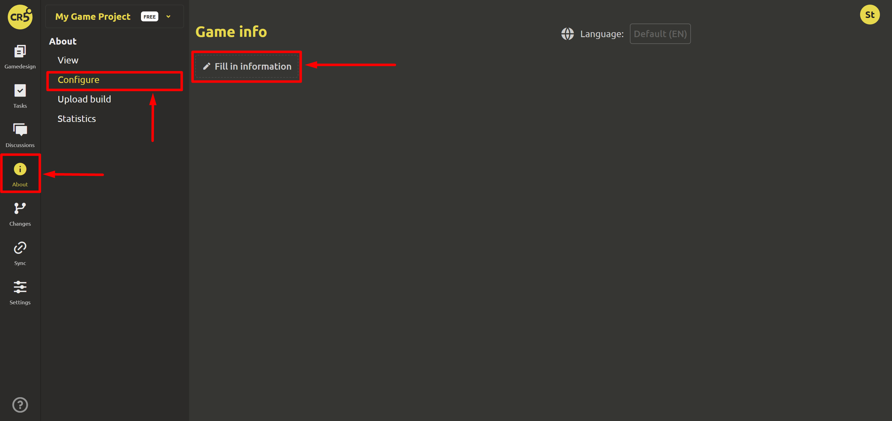

# Setting up the “About” page

To add information to the "About the game" page, go to the "About the game" tab, select the "Configure" item and click the "Fill in information" button.

## Step 1. General information

It is necessary to fill in general information about the game (all fields can be changed at any time):

- `Genre`. You can select several genres from the suggested list.
- `Developer`. Enter your name or the name of the team.
- `Release date`.
- `Cover image`. Select the file (460x215) for the game cover. This file will be used on the space page and in the catalog card.
- `Description`. This description will be indicated on the catalog page inside the game card.

## Step 2. Links

If you have social networks or platforms that the game has already been uploaded to, then you can place the information in the `Links` block. You should click on the `Add` button and in the window that opens specify the name of the link (for example, Facebook, Telegram, etc.) and the link itself.

## Step 3. Gallery

Here you can add screenshots of your game and trailer. Ready!

