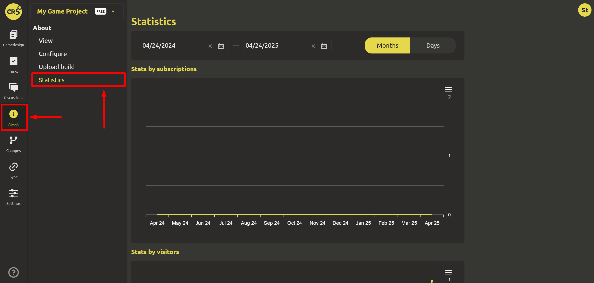

# Viewing community statistics

In order to view the community statistics, go to the `About game` tab -> `Statistics`.

For more information, you can specify the statistics parameters:

- The period under consideration (from what date to what date)
- Display method (by month/by day)

Available in IMS Creators:

- Stats by subscriptions
- Stats by visitors
- Stats by views
- Stats by downloads
- Stats by unique downloads