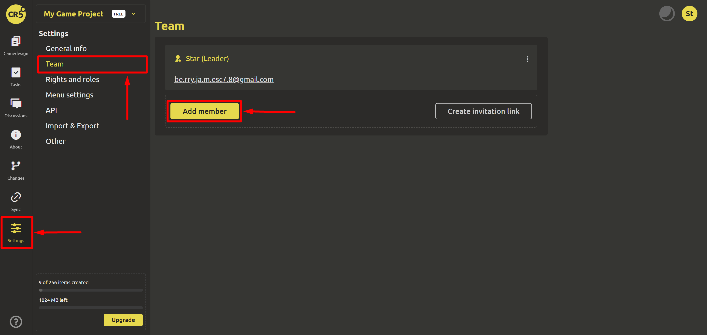
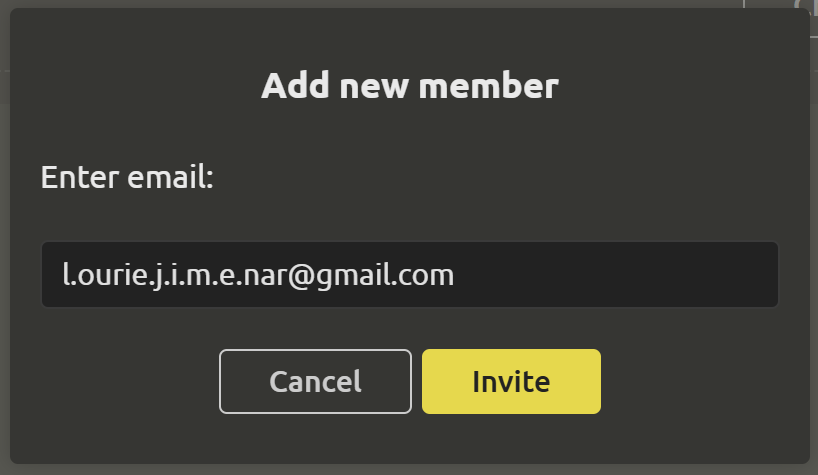
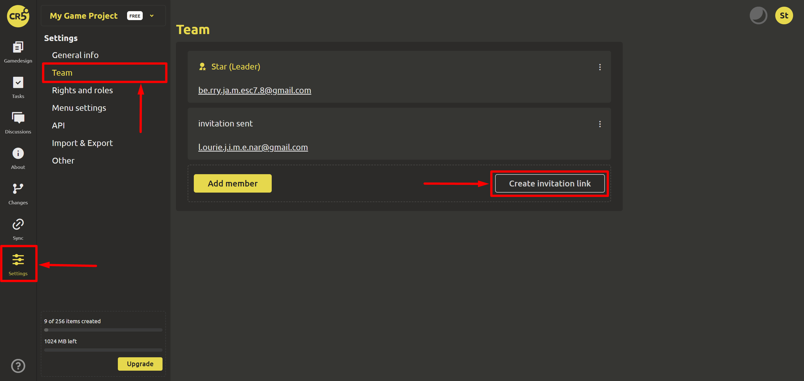

# Invitation to team

It is better to work on a project in a friendly team. In IMS Creators there is no limit on the number of team members. So let's invite like-minded people to our project. You can invite people to the project by email or by invitation link.

## Invitation by email

In the left menu, select the section "Settings" -> "Team" and click `Add member`.

A dialog box will open where you need to enter the email of the new member.

Done! All that remains is to wait for the new member to follow the link from the email sent to the email.

## Creating an invitation link

If you already have a team, you can create an invitation link and upload it to the group so that all members can quickly follow it and become part of a large and friendly team in the IMS Creators system.

In the left menu, select the "Settings"->"Team" section and click `Create invitation link`.

You can copy the link. After all team members have followed the link, you can delete it.