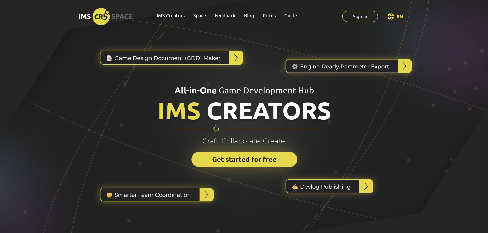
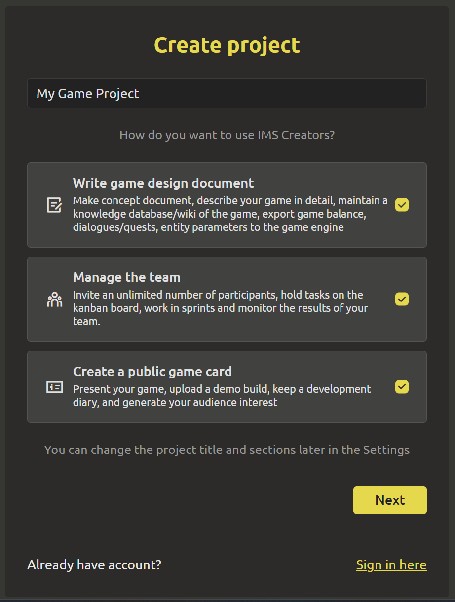
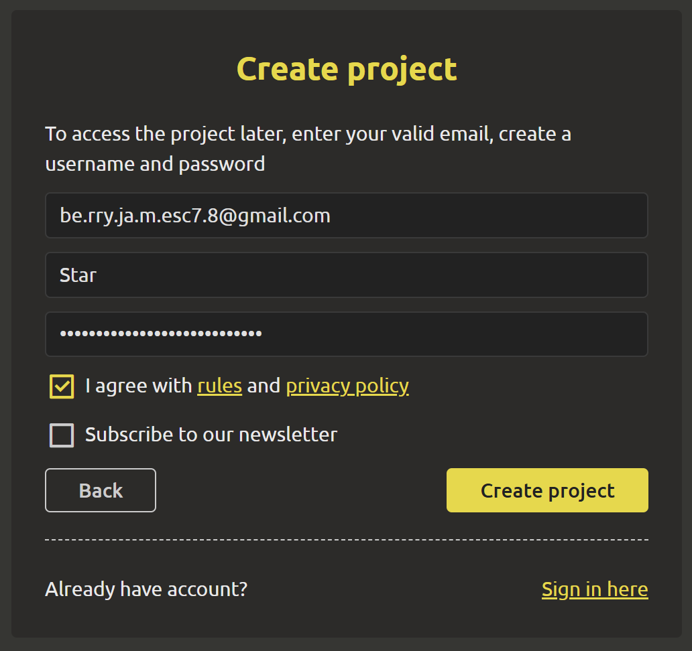
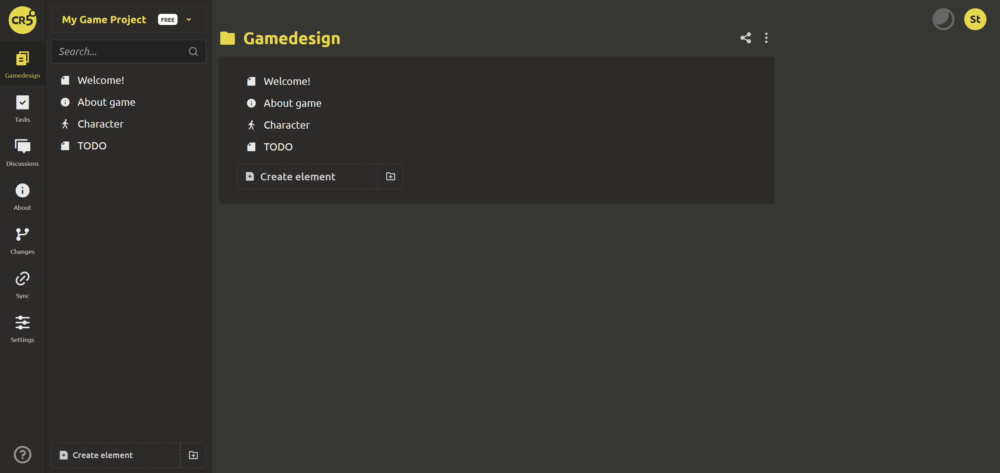
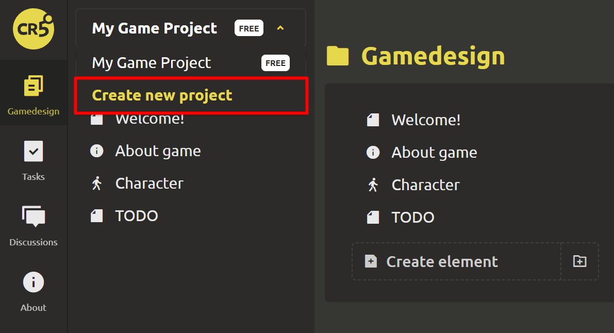
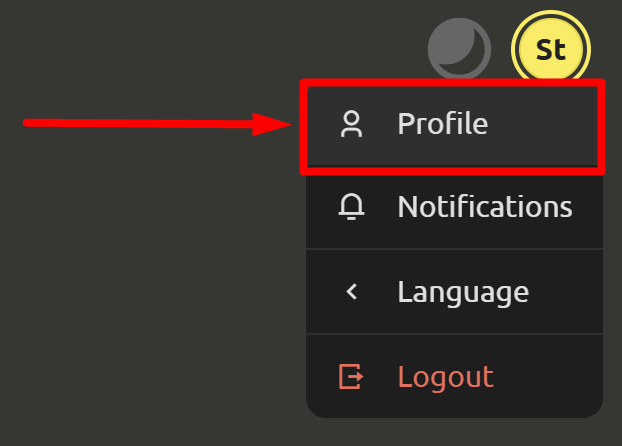
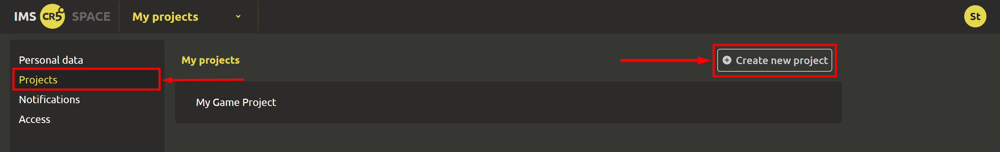

# Quick start

## Registration and project creation

Try working in IMS Creators for 24 hours without email confirmation! To do this, follow the link to the main page of [IMS Creators](https://ims.cr5.space/en) and click `Get started for free`.

A form for creating a project will open, where you need to enter the name of the project and check the boxes next to the functions required for work:

1. **Write game design document**.

    Make concept document, describe your game in detail, maintain a knowledge database/wiki of the game, export game balance, dialogues/quests, entity parameters to the game engine.

2. **Manage the team**.

    Invite an unlimited number of participants, hold tasks on the kanban board, work in sprints and monitor the results of your team.

3. **Create a public game card**.

    Present your game, upload a demo build, keep a development diary, and generate your audience interest.

::: tip
You can change the project name and sections later in Settings
:::

To access the project later, enter your **valid** email, create a username and password:

Be sure to read and agree to the [rules](https://ims.cr5.space/en/terms) and [privacy policy](https://ims.cr5.space/en/privacy). Then click on `Create project`.

Congratulations!!! 🎈🎈🎈 Your first project has been successfully created. Don't forget to follow the link in the letter sent to the specified email to confirm your email.

## Adding new project
You can craete so many projects as you can. So do not stop in your creativity, create more and more new game projects easily and conveniently in different ways:

1. Using the left menu.
Click on the "Game Design" section, open the list of game projects at the top of the tab and select `Create new project`.

2. Through the user's personal account.
In the upper right corner, click on the yellow button with your name and select `Profile` from the drop-down list.

In the profile, select the "Projects" item and click on the button `Create a new project`.

