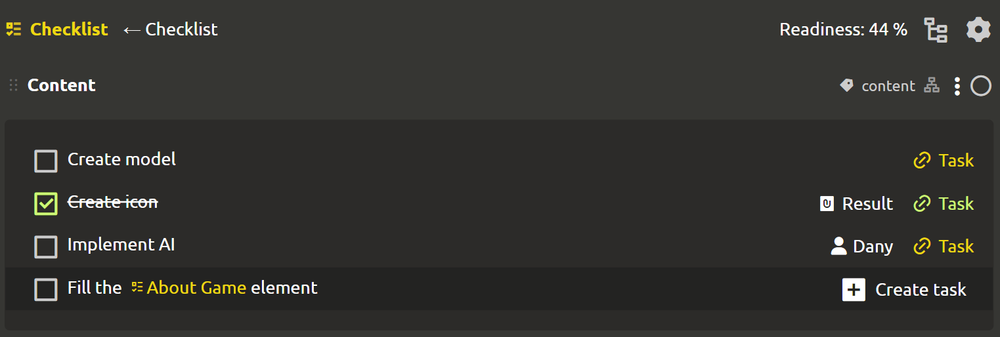
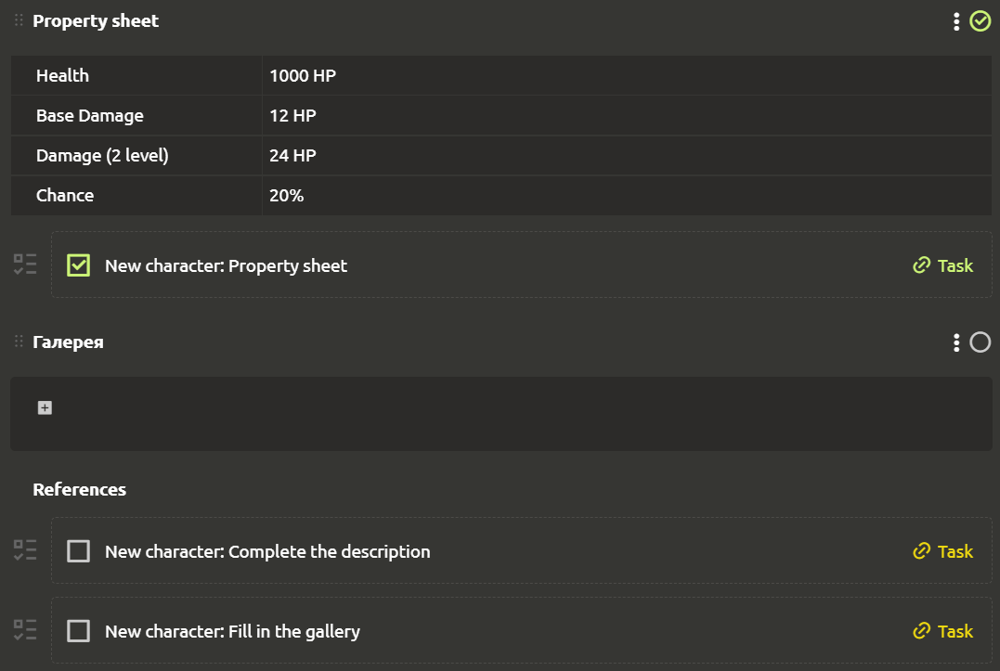
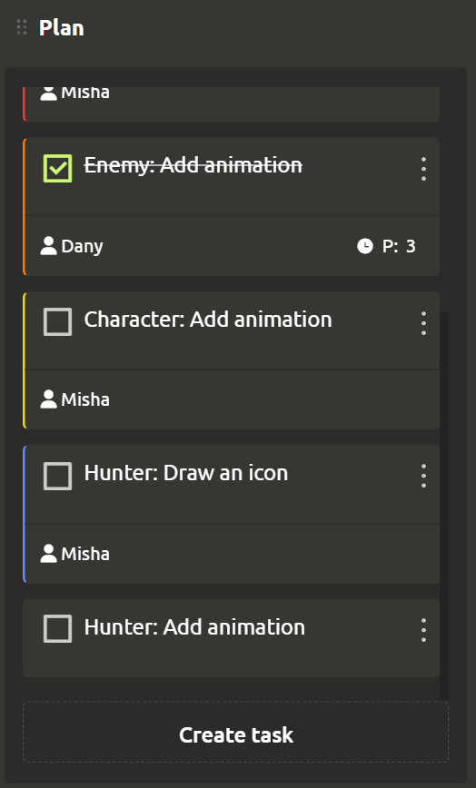

# Creating tasks

Create tasks wherever it is convenient for you. At the moment, tasks can be created from a checklist, elements, blocks and a kanban board.

## From the checklist

To create a task from the checklist, select the element containing the `Checklist` type block and click on the `+ Create task` button displayed on hover, located to the right of each item in the checklist.

A dialog box opens with the generated task name, which you can change if desired. After clicking on the 'Create` button, the task settings window opens.

If user assigned to the task, then this information will be reflected to the right of the item inside the checklist. To view the task editing, just click on the `Task` on the right. If the task is completed, it is marked in green, otherwise yellow.

## Attaching to blocks and elements

You can create tasks by linking them to blocks and elements. To do this, click on the ellipsis in the upper-right corner of the element (or block) and select either `Create task` (for the element) or `Create subtask` (for the block).

The element will have a new `Links` section located under all the blocks, where the tasks attached to the element will be reflected. And the subtasks attached to the block will be located under this block.

## From the kanban board

All tasks created from the checklist, as well as attached to elements and blocks, can be found on the kanban board on the Tasks tab. Here the tasks are divided into columns and even separate boards! To create a task, click on the `Create task` button located at the bottom of the column of interest.

