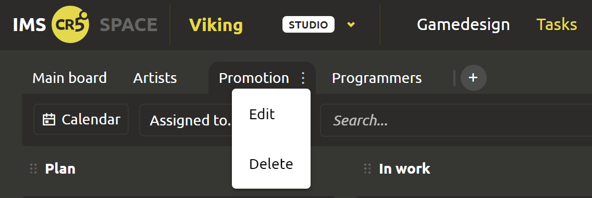
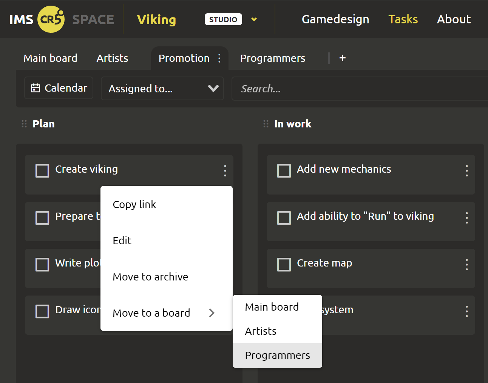

# Team Management

## Creating custom boards

If you are the head of some department or the entire game project (in general, “not the last person” in the company), then this functionality will melt your heart) This task tracker presents you with the following features.

There are different types of tasks. For example, they can be designed for people from different industries (gameplay, sound, art, promotion, etc.). If you store all the tasks on one board, it will be very difficult to manage. Also, if you work in sprints, you may want to highlight the tasks of each of the sprints separately. For holders of the INDIE and STUDIO licenses, we offer the creation of custom boards. You can split the tabs according to the following principle: Artists, Promotion, Programmers. Or in another way... whatever you want, do it) To create a board, click on the ”+" at the top of the Tasks page.

## Moving tasks

Tasks can be moved inside columns, between columns, and even between boards!

::: tip
When moving a task, a white line highlights the place where the task will be placed. And at the time of saving the changes, a progress bar bar will appear on top so that you can see that the request is being processed.
:::

Tasks can be moved from one board to another in 2 ways:
1. Grab the task and drag it to the desired board.
2. In 3 clicks: click on the dots on the right -> select “Move to a board” -> click on the desired board in the drop-down list.
