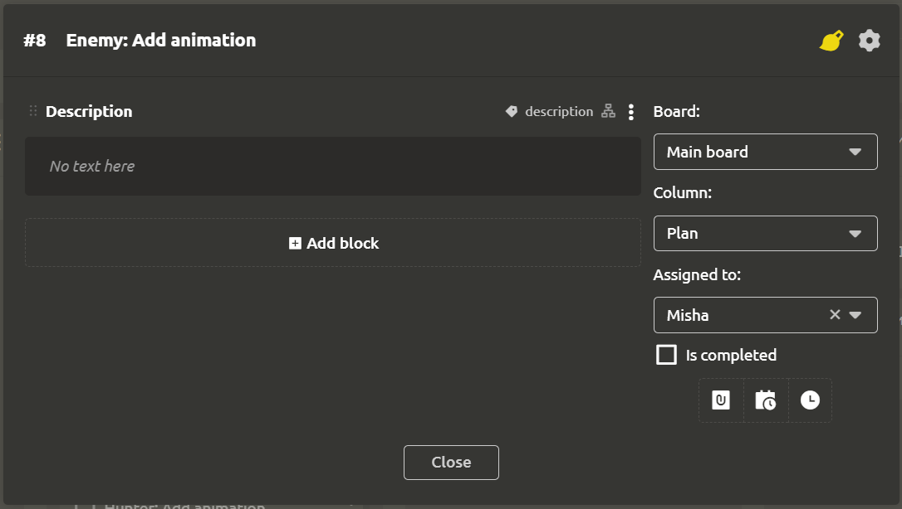

# Task Settings

Tasks in IMS Creators have a flexible structure. The basic settings can be edited in the settings window.

## Settings header

When you double-click on the task name, the editing mode is enabled.

By clicking on the Brush icon in the drop-down menu, you can select the color of the task. This color will be used to highlight the left outline of the task block inside the column.

When clicking on the gear, the following actions are available:
- `Copy link`
- `Rename`
- `Create subtask`
- `Create reference to element`
- `Move to archive`

## The main block

By default, a Description block is created where you can add details of the task. You can create any blocks here.

## The right menu

The following fields are located in the right menu:

- `Board`
- `Column`
- `Assigned to`
- `Is completed`

Below there is a button consisting of 3 parts:

- `Scheduled at`. If the task must be completed by a certain date, then the date and time can be specified in the field that appears above
- `Time'. Each task requires labor. When you click on the button, a section for specifying the time will appear in the header of the settings window. Here you can specify the planned and actual labor costs in the tasks. This will allow you to evenly plan the load on team members, as well as respond in a timely manner to delays in tasks.

You can specify on which board and in which column the task should be placed, as well as assign its performer. After completing the task, you should mark it completed with a check mark.
