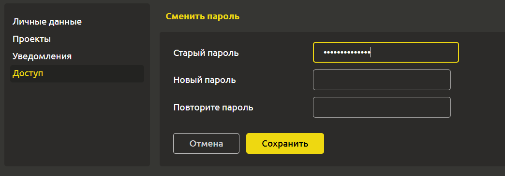

# Смена пароля

Для смены пароля перейдите на вкладку `Профиль` -> `Доступ`. Для этого кликните на свое имя в правом верхнем углу и в выпадающем списке кликните `Профиль`. В левом меню будет расположен раздел `Доступ`.

Введите `Старый пароль`, `Новый пароль` и повторите новый пароль.

