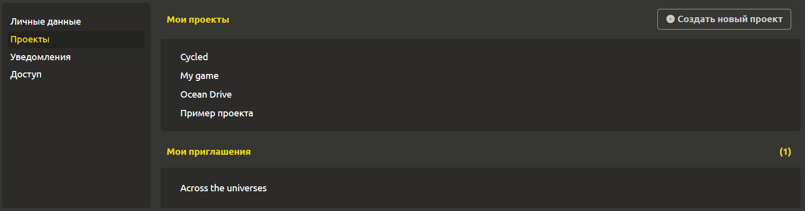

# Мои проекты и приглашения

Для управления проектами перейдите на вкладку `Профиль` -> `Проекты`. Здесь находится 2 раздела.

## Мои проекты

Для создания нового проекта нажмите на кнопку `+ Создать новый проект` в правом верхнем углу. Для перехода к существующему проекту следует кликнуть на него.

## Мои приглашения

Здесь Вы можете увидеть свои приглашения в проекты. Указывается список проектов. При клике на 1 из них открывается диалоговое окно с подтверждением принятия приглашения.