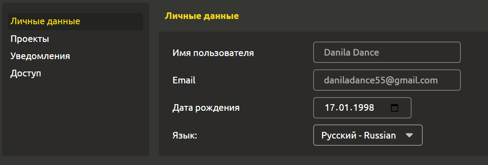
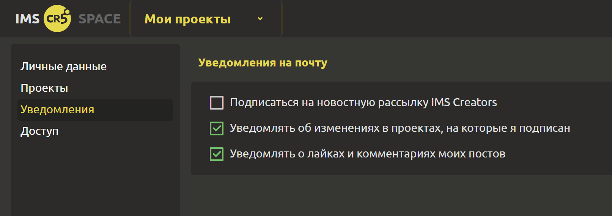

# Настройка профиля

Пользователь может добавить дату рождения и указать родной язык. 

В разделе `Уведомления` доступно 2 настройки:
- Подписаться на новостную рассылку IMS Creators
- Уведомлять об изменениях в проектах, на которые я подписан
- Уведомлять о лайках и комментариях моих постов

