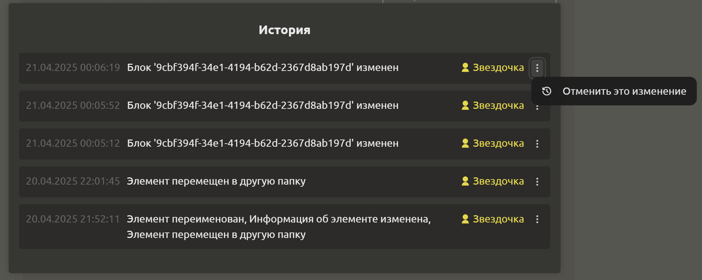
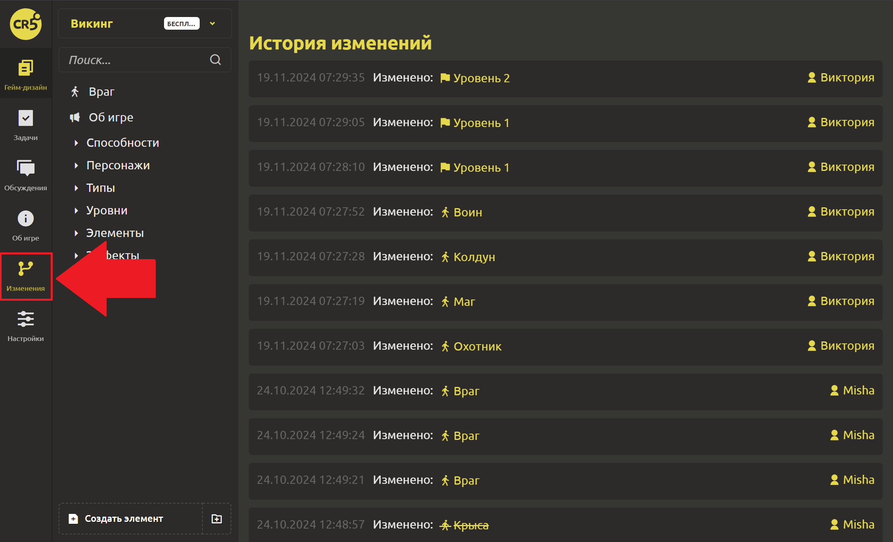

# История изменений

## Изменения выбранного элемента

Для просмотра изменений необходимо нажать на 3 точки в правом верхнем углу элемента и кликнуть на `История`.

::: tip
Вы можете отметить изменения. Если Вы хотите отменить несколько, то отменяйте последовательно!
:::

## Изменения всего гейм-дизайн документа

После долго перерыва очень трудно вспомнить, на каком месте остановился? Теперь проблема больше не возникнет! Главное - запомните путь. В левом меню “Изменения”. Можно кликнуть на элемент и продолжить работу с того места, где остановился.

История изменений станет отличным решением, если участникам понадобится узнать какие были внесены изменения.