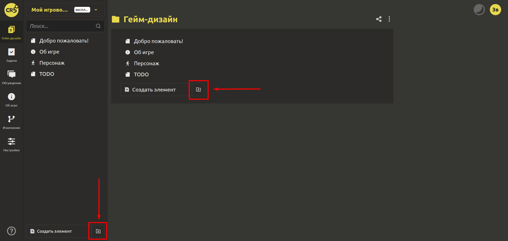
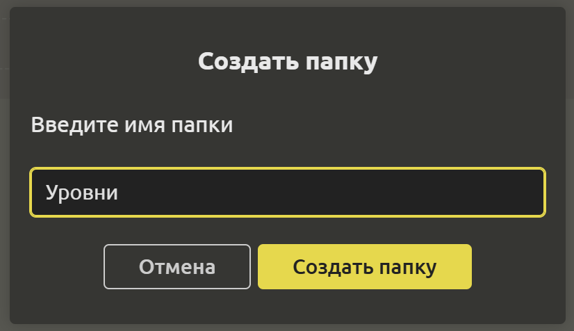
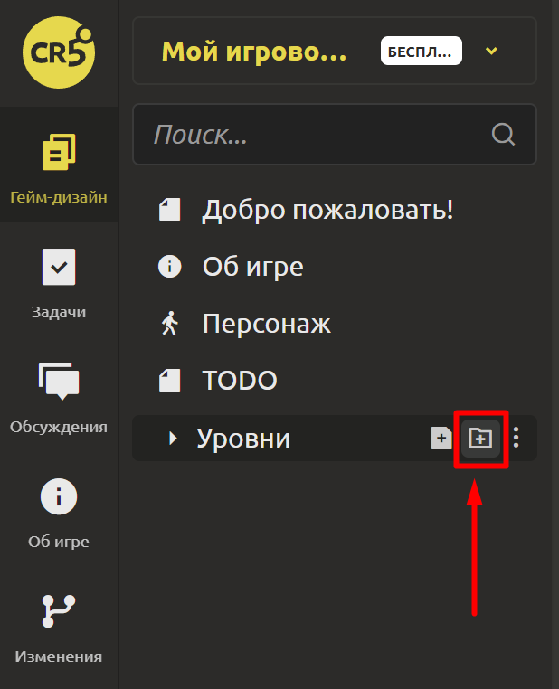
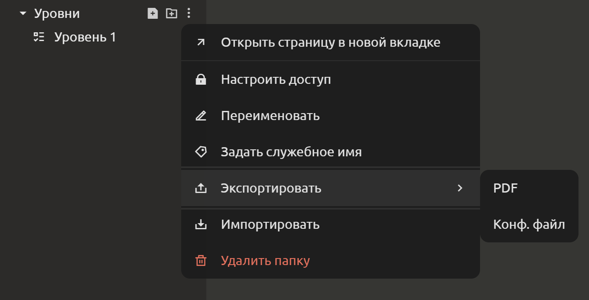
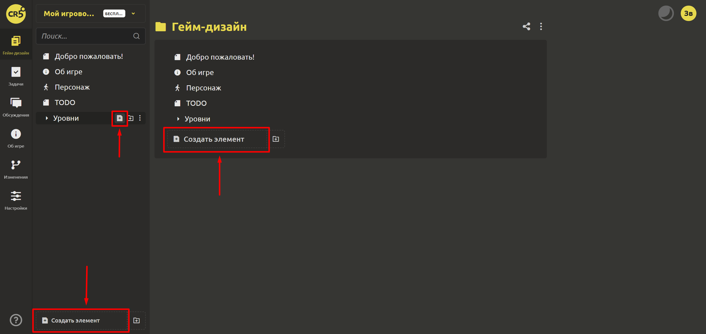
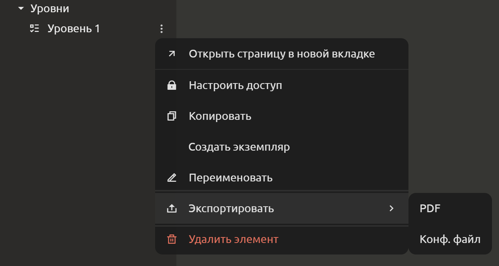

# Создание разделов документа

Гейм-дизайн документ должен быть хорошо организован. Чтобы быстро и легко ориентироваться в нем, используйте папки и элементы.

## Создание папок

Перейдите на вкладку “Гейм-дизайн”. В нижней части левого меню расположена кнопка с иконкой папки. Кликните на неё, чтобы создать папку.

После этого откроется диалоговое окно, где нужно будет ввести имя новой папки.

Отлично. Папка создана! В IMS Creators доступна многоуровневая структура. Для создания подпапок наведите курсор на интересующую папку и кликните на иконку папки.

Для редактирования папок используйте раскрывающийся список в виде 3 точек:

## Создание элементов

Перейдите на вкладку “Гейм-дизайн”. В нижней части левого меню расположена кнопка `Создать элемент`. Кликните на неё, если хотите создать элемент в корне гейм-дизайн документа. Если нужно создать элемент внутри папки, то наведите курсор на нужную папку и кликните на иконку с файлом.

После этого откроется диалоговое окно, где нужно будет ввести имя нового элемента и выбрать тип элемента:
1. **Список задач**. Отлично подойдет для хранения списка задач в рамках спринта. Также может выступать в качестве списка задач, сгруппированных по определенному критерию (например, список ошибок или же наоборот, список идей для реализации в будущих версиях).
2. **Диаграмма**. Прекрасно впишется в гейм-дизайн документ, если нужно что-то нарисовать или отразить на схеме.
3. **Сценарий**. У каждой игры есть начало и конец. А между ними какой-то сюжет. Возможны разные исходы событий, которые лучше оформить в виде сценариев, чтобы не запутаться в сюжетных линиях. Информацию о том, как им пользоваться, Вы найдете в [здесь](../gdd/editing-elements.md).
4. **Пользовательский**. Вы можете создавать свои элементы и типы, и на их основе создавать новые! Как это работает, подробно написано в разделе [Шаблоны элементов](../gdd/element-templates.md#создание-шаблона).
5. [**Структура**](../gdd/structures-and-enums.md#структуры).
6. [**Перечисление**](../gdd/structures-and-enums.md#перечисления).

Например, при выборе типа `Список задач` будет создан элемент с блоком типа `Чек-лист`. Аналогично работают другие типы.

Отлично. Элемент создан! Для редактирования элемента используйте раскрывающийся список в виде 3 точек:

## Перемещение папок и элементов

Для перемещения кликайте на папку или элемент и, не отпуская, перенесите в нужное место.