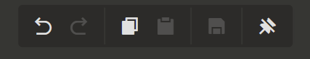
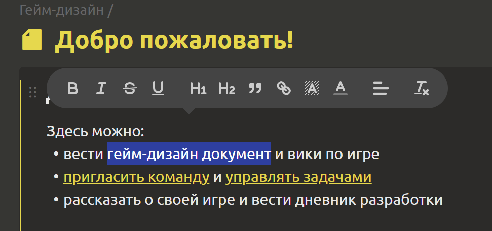
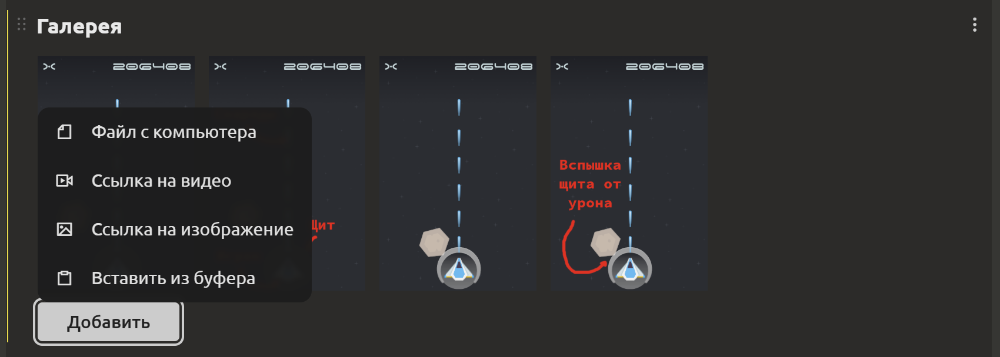
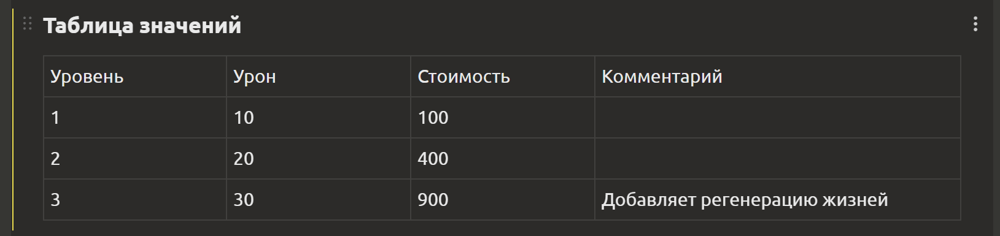
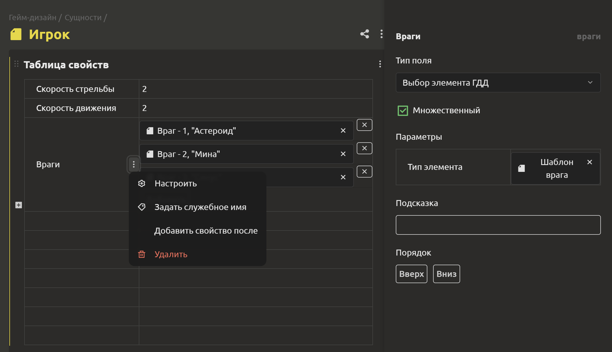
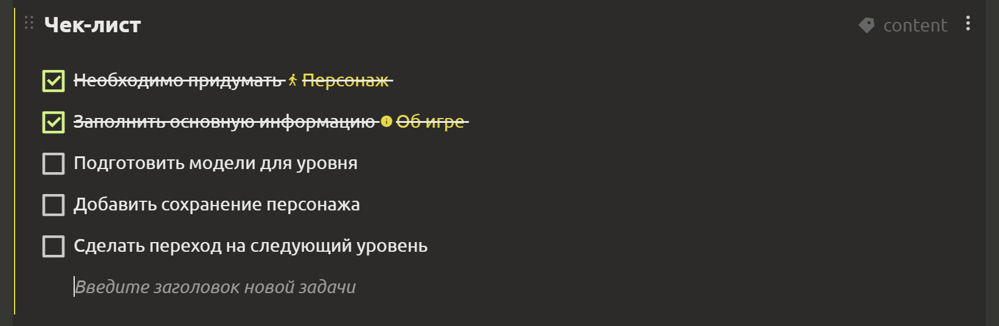
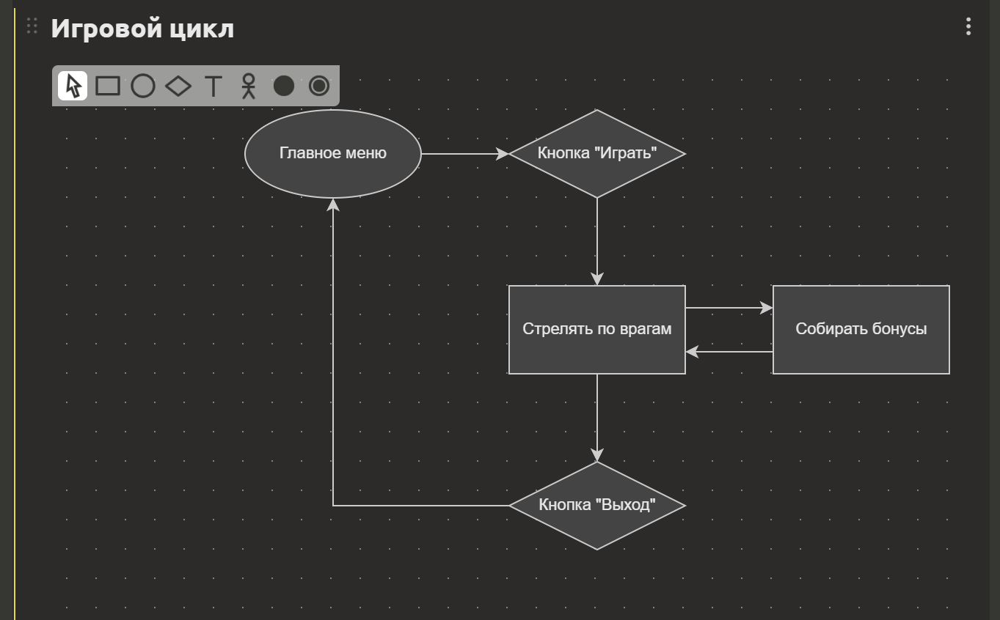
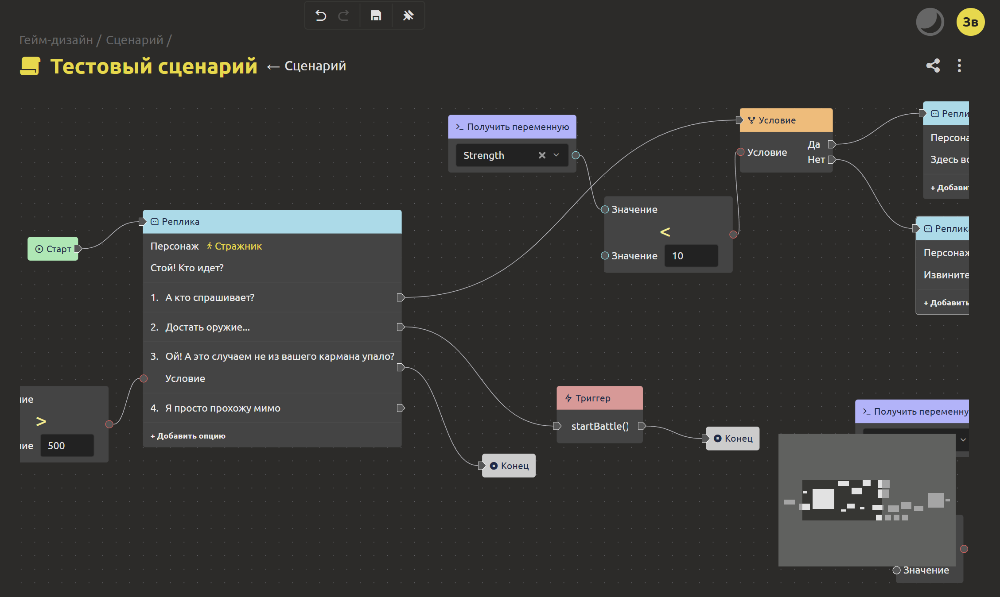
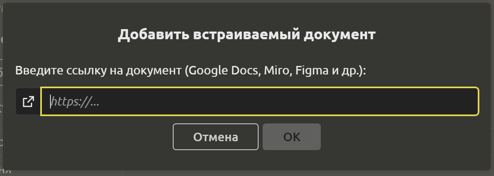
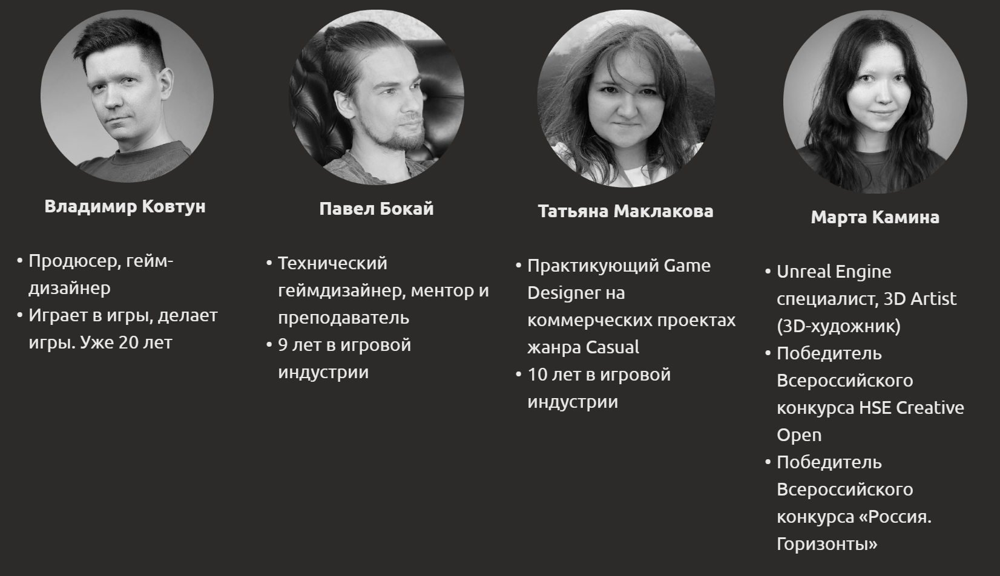

# Редактирование элементов

## Редактирование блоков

Внутри элементов можно создавать блоки разных типов:

- [Текст](#блок-текст)
- [Галерея](#блок-галерея)
- [Таблица значений](#блок-таблица-значении)
- [Таблица свойств](#блок-таблица-своиств)
- [Чек-лист](#блок-чек-лист)
- [Блок-схема](#блок-блок-схема)
- [Сценарий](#блок-сценарии)
- [Встроенный документ](#блок-встроенный-документ)
- [Текст сеткой](#блок-текст-сеткои)

::: tip
Внутри каждого из этих блоков можно использовать ссылки на элементы проекта. Для этого необходимо ввести "№", "@" или "#" (в зависимости от раскладки клавиатуры), после чего выбрать элемент из выпадающего списка.
:::

## Панель редактирования

Панель редактирования станет незаменимым помощником, когда потребуется:
- ↩️ Отменить изменение
- ↪️ Повторить изменение
- 📃 Копировать блок
- ➕ Вставить блок
- 🗃️ Сохранить изменения

::: tip
При клике на 📌 можно закрепить/открепить панель редактирования.
:::

## Блок “Текст”

В блоке `Текст` можно размещать текст, картинки и GIF. Пользуясь редактором, можно форматировать текст:
- "Жирный" (`Ctrl + B`)
- "Курсив" (`Ctrl + I`)
- "Зачеркнутый"
- "Подчеркнутый"
- "Заголовок 1"
- "Заголовок 2"
- "Цитата"
- "Ссылка"
- "Фон"
- "Цвет"
- "Выравнивание текста"
- "Очистить формат"

## Блок “Галерея”

В блоке `Галерея` можно добавлять файлы с компьютера (картинки и видео) и ссылки на видео. Для добавления используйте `+`, расположенный внутри блока. Вы можете управлять порядком картинок, схватив один из элементов и перетащив в нужное место.

## Блок “Таблица значений”

В блоке `Таблица значений` можно добавлять строки и столбцы.

## Блок “Таблица свойств”

В блоке `Таблица свойств` расположены 2 колонки. В левой колонке вводится название свойства, а в правой указывается значение. Для добавления нового свойства можно нажать на `+` слева от названия свойства либо на точки справа и `Добавить свойство после` в выпадающем списке. Для удаления нужно кликнуть на точки и выбрать соответствующий пункт.

Свойства можно `Настроить`, кликнув на точки справа. Справа откроется вкладка с выбором параметров:
- `Тип поля`. Поле может быть следующих типов: `Строка`, `Число`, `Текст`, `Флажок`, `Выбор даты`, `Выбор файла`, `Структура`, `Перечисление`, `Перечисление(радио-кнопки)`.
- `Множественный`. Если у свойства может быть несколько значений, то нужно поставить галочку.
- `Порядок`. Содержит 2 кнопки: `Вверх` и `Вниз`, используемые для изменения порядка свойств.

::: tip
Вы можете создавать составные поля с помощью элементов с типом "Структура". Более подробно о том, как их создать [здесь](structures-and-enums.md#структуры-и-перечисления).
:::

## Блок “Чек-лист”

В блоке `Чек-лист` можно размещать задачи, которые необходимо выполнить.

Для создания новой задачи нужно нажать `Enter`.

Если задача быстровыполнимая, то после её выполнения можно пометить её зеленой галочкой, нажав на серый кружок слева.

Если задача важная и занимает большое количество времени, её можно поместить на доску с задачами. Для этого кликните на кнопку `+ Создать задачу`, которая появляется при наведении на один из пунктов чек-листа. В открывшемся окне можно настроить параметры задачи.

::: tip
Подробнее о задачах в следующем разделе.
:::

## Блок “Блок-схема”

В `Блок-схеме` можно добавлять текст, прямоугольники, овалы, ромбы и другие фигуры, соединяя их стрелками.

С помощью блок-схем можно наглядно представить:

- дерево навыков/улучшений/технологий,
- сториборды,
- последовательность этапов или глав игры,
- демонстрация игрового цикла.

Причем, в узлы схемы можно вставлять не только текст, но и ссылки на другие элементы геймдизайн-документа через # или №. Получается интерактивная карта, которая облегчит навигацию по документу.

Как и другие блоки, блок-схемы можно вставлять и в задачи, что поможет правильно их поставить, описать нужные алгоритмы, накидать архитектуру и много чего ещё. 

Высока вероятность, что графический редактор придется тебе по душе настолько, что уже не захочется выходить из IMS Creators, чтобы раскидать по полочкам свои мысли.

## Блок “Сценарий”

В блоке “Сценарий” можно вести сюжетную линию, создавать разветвленные диалоги, разрабатывать внутриигровые скрипты.

## Блок “Встроенный документ”

В качестве встроенного документа могут выступать: Google таблицы, Google документы, Youtube. Для создания блока необходимо ввести ссылку на документ и название документа.

Вы можете работать с документом не выходя из IMS Creators. Весь функционал сохраняется.

## Блок “Текст сеткой”

В блоке “Текст сеткой” можно разбивать текст на колонки.

