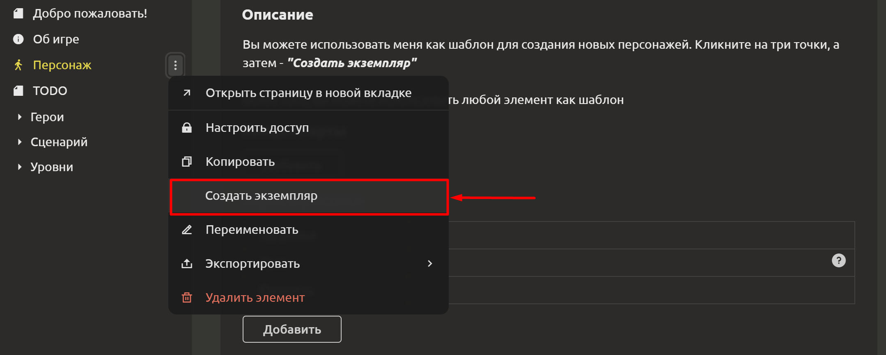
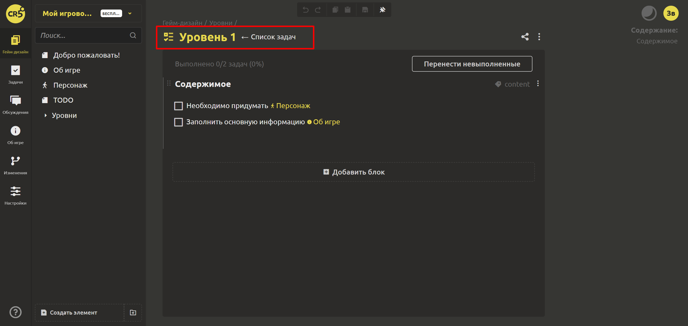
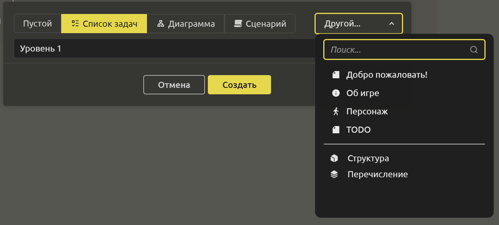

# Шаблоны элементов

## Создание шаблона

Любой элемент по Вашему желанию может стать шаблоном. Хорошая новость - Вам для этого ничего делать не надо 😉

## Создание экземпляра

Экземпляры можно создавать 2 способами:
1. Через меню родительского элемента.
При создании экземпляра новый элемент становится дочерним, а исходный элемент становится родительским. При редактировании родительского элемента изменения автоматически переносятся и в дочерние элементы.

То, что элемент был создан по шаблону, можно определить по блоку с названием. Стрелка после названия указывает на родителя. Для быстрого перехода к родительскому элементу необходимо кликнуть на него.

Вы можете создавать многоуровневые цепочки наследования, наследуя элементы от дочерних.

2. При создании элемента. В диалоговом окне создания элемента можно выбрать родителя. Подробнее о том, какие базовые родительские элементы уже предусмотрены в системе, читайте [здесь](creating-doc-sections.md#создание-элементов).

